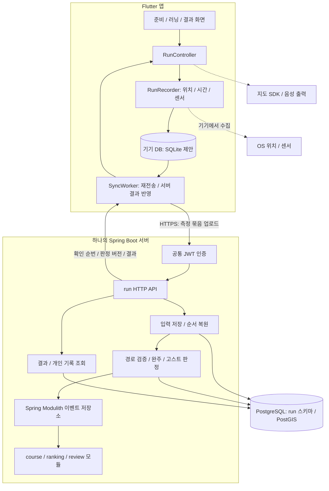
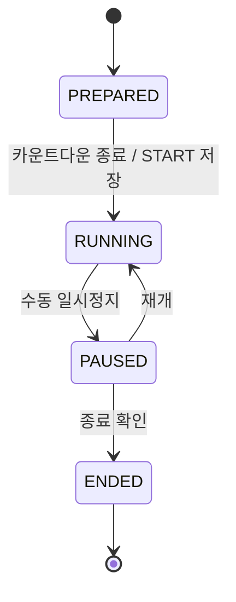
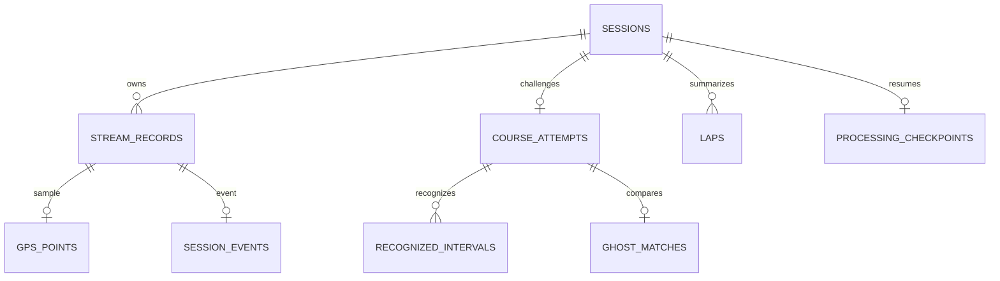

# 달리기 개발 아키텍처

작성일: 2026-10-06 · 기술 스택: Flutter / Java Spring Boot / PostgreSQL

**핵심 구조: Flutter가 측정·기기 저장·실시간 표시를 담당하고, Spring Boot의 `run` 모듈이 기록 검증·코스 완주·고스트 결과를 판정한다.** 서버는 팀 개발 규칙에 맞춰 Spring Modulith 기반 모듈러 모놀리스로 구성한다. PostgreSQL은 모듈별 스키마로 분리하고 공간 데이터에는 PostGIS를 사용한다.

## 1. 근거와 범위

확인한 자료:

- [프로젝트 노션](https://app.notion.com/p/3cd058de3902801694a9d6458b3ebff0): 프로젝트 문서 목록을 브라우저에서 확인했다. Notion 연결 도구는 접근 오류가 발생했다.
- [노션 개발 정책](https://app.notion.com/p/ee2058de3902820896e281ddaaafda4c): 브라우저로 본문을 확인했다. 2026-10-02 작성 초안이며, Spring Modulith·PostGIS·모듈별 스키마·JWT·Flyway·이벤트 연동 규칙을 명시한다.
- [피그마 와이어프레임](https://www.figma.com/design/AHA57jFG1znDzxdmGWHGUm/?node-id=1453-2946): 전체 화면 구조와 달리기 기본 화면을 확인했다.
- [작업 폴더의 2026-10-06 정책 정리본](./final-policy-2026-10-06/홈·코스·달리기%20통합%20설계서%20-%20일관성%20정리본.md): 달리기 기능 규칙의 기준으로 사용했다. 노션의 개별 달리기 정책 페이지와 현재 내용이 같은지는 직접 대조하지 못했다.

아래 클래스명·테이블명·API·전송 방식은 **개발 설계 제안**이다. 정책 정리본에서 확정한 기능 규칙과 구분한다. 실제 코드를 구현하거나 DB에 적용한 문서는 아니다.

달리기 담당 범위는 자유 러닝, 코스 러닝, 고스트 대결, 위치·시간·거리 측정, 수동 일시정지, 기기 저장·동기화, 결과·랩·기록 조회, 완주·리뷰 자격 판정, 현재 코스 러너 수 제공이다. 코스 생성·검색, 랭킹 집계·화면, 리뷰 CRUD, 회원 인증은 다른 모듈의 책임이다.

### 화면과 구현 연결

| 피그마 화면 | 달리기 기능 | 주 담당 구성요소 |
|---|---|---|
| C5 / C6 / C1 | 자유·코스·고스트 준비 | RunPrepareController, 시작 검증 API |
| C2 / C8 / C9 / C10 | 코스·고스트 선택 | 코스 조회 API, GhostService |
| H1 / H4 / H5 | 3초 카운트다운 | RunController, 시작 이벤트 |
| C4 / C4-1 / C4-2 | 기본 지표·지도·고스트 격차·랩 | RunRecorder, MetricCalculator, GhostPlayback |
| 러닝 일시정지 | 정지·재개·종료 확인 | 세션 상태 전이, 정지 이벤트 |
| 경로 이탈 / GPS 끊김 | 안내·자동 자유 전환·측정 품질 표시 | RouteGuidance, AudioGuide, SyncWorker |
| D1 / D1-1 / D1-2 / D2 | 전체 결과·미완주·자유·대결 결과 | RunResultController, 서버 결과 조회 |
| I1 및 기록 상세 | 개인 기록 조회·삭제 | RunQueryService, RunDeletionService |

AI 추천 고스트는 고도화로 분리한다. 내 최고·최근·과거 완주 고스트 선택은 MVP에 포함한다. 결과에서 코스 만들기로 전달하는 것은 코스 인정 경로가 아닌 **세션 전체 실제 주행 경로**다.

## 2. 전체 구조



앱은 PostgreSQL에 직접 접속하지 않는다. 온라인 통신이 실패해도 측정은 기기 저장을 통해 계속된다. 실시간 서버 완주는 업로드 응답 또는 상태 조회로 전달한다. 고스트는 내려받은 과거 기록을 앱에서 재생하므로 실시간 상대 위치 공유나 WebSocket이 필수는 아니다.

초기에는 HTTP 묶음 업로드와 상태 조회를 사용한다. 팀 공통 SSE가 준비되어 있으면 판정 변경 알림을 추가할 수 있지만, 알림이 누락되어도 조회로 복구해야 한다. Redis·Kafka·별도 GPS 서버는 초기 필수 구성에 넣지 않는다. 부하 지표에 따라 추후 `run`을 분리한다.

## 3. Flutter 내부 구조

화면과 데이터를 분리하는 [Flutter 구조 권장사항](https://docs.flutter.dev/app-architecture/recommendations)을 바탕으로, 측정과 동기화는 화면보다 긴 수명을 갖게 설계한다.

```text
lib/
  core/                         # 팀 공통: 인증, HTTP, 지도, 위치 권한
  features/run/
    presentation/
      run_prepare_screen.dart
      ghost_select_screen.dart
      run_tracking_screen.dart
      run_pause_screen.dart
      run_result_screen.dart
      run_history_screen.dart
      run_controller.dart
    application/
      run_recorder.dart
      run_sync_worker.dart
      run_recovery_service.dart
    domain/
      run_state.dart
      run_repository.dart
      metric_calculator.dart
      route_guidance.dart
      ghost_playback.dart
      audio_guide.dart
    data/
      run_repository_impl.dart
      run_local_store.dart
      run_api_service.dart
      location_service.dart
      sensor_service.dart
      models/
```

| 구성요소 | 책임 |
|---|---|
| RunController | 사용자 조작 처리, 화면 상태 제공, 서버 판정 반영 |
| RunRecorder | 위치·센서 입력 직렬화, 측정 시계, 정지/재개, 로컬 기록 |
| MetricCalculator | 정상 측정 구간의 거리·시간·페이스·자동 랩 계산 |
| RouteGuidance | 코스상 위치의 표시 추정, 이탈 후보·확정 안내. 완주 판정은 하지 않음 |
| GhostPlayback | 총 소요시간 축에서 고스트 위치·격차 재생 |
| AudioGuide | 거리 또는 달린시간 간격 안내, 이탈·완주 음성, 중복 억제 |
| RunRepository | 로컬 측정값·원격 판정값을 일관된 앱 상태로 제공 |
| RunLocalStore | 원본 표본, 조작 이벤트, 스냅샷, 전송 대기 상태 저장 |
| RunSyncWorker | 미확인 입력 재전송, 누락 복구, 종료 동기화, 최신 결과 조회 |

상태 관리 라이브러리는 팀의 기존 선택을 따른다. Riverpod·BLoC 등은 이 구조를 구현하는 수단이며 아키텍처의 필수 조건은 아니다. 기기 저장은 SQLite 계열 저장소를 제안하며, 특정 Flutter 패키지는 실기기 검증 후 선택한다.

**측정 입력은 먼저 내구성 있게 기기에 저장하고 업로드한다.** 로컬 기록과 전송 대기 표시를 같은 트랜잭션으로 저장해 앱 종료 시 재전송 대상을 잃지 않는다. 화면을 이동하거나 지도를 숨겨도 수집과 저장이 유지되어야 한다. 이 방식은 [Flutter 오프라인 우선 설계](https://docs.flutter.dev/app-architecture/design-patterns/offline-first)를 달리기 요구사항에 적용한 제안이다.

## 4. Spring Boot의 run 모듈

팀 규칙대로 모듈 루트에는 공개 인터페이스·DTO를 두고, 내부 구현은 `internal`에 둔다. 아래는 구현 시작용 구성이다. 내부 파일을 하위 패키지로 나누면 Java의 package-private 접근 범위가 달라지므로 그때 접근 제어를 다시 설계한다.

```text
<프로젝트 기본 패키지>/
  run/
    RunApi.java                   # 모듈 공개 계약
    RunSummary.java
    RunResult.java
    ActiveCourseRunnerCount.java
    internal/
      RunController.java
      RunSessionService.java
      RunIngestionService.java
      RunProcessingService.java
      RunQueryService.java
      RunDeletionService.java
      CourseMatchingEngine.java
      CourseCompletionPolicy.java
      ReviewEligibilityPolicy.java
      GhostService.java
      GhostMatchPolicy.java
      RunEventHandler.java
      RunErrorCode.java
      RunSession.java
      RunStreamRecord.java
      CourseAttempt.java
      GhostMatch.java
      RunSessionRepository.java
      RunStreamRepository.java
      CourseAttemptRepository.java
      RunStubImpl.java
  event/
    CourseRunStartedEvent.java
    CourseRunCompletedEvent.java   # 신규 제안: 종료 전 완주 이벤트
    RunSessionEndedEvent.java
    RunRecordDeletedEvent.java
```

| 계층 / 서비스 | 처리 |
|---|---|
| Controller | JWT 사용자 확인, 요청 형식 검증, 팀 ApiResponse 반환 |
| RunSessionService | 준비·시작·정지·종료 상태 전이, 시작 스냅샷 확보 |
| RunIngestionService | 원본 입력 묶음 저장, 재전송 중복·충돌 확인, 누락 순번 제공 |
| RunProcessingService | 세션별 순서대로 검증, 판정 체크포인트, 파생 지표 저장 |
| CourseMatchingEngine | GPS 정제, 기준 경로 대응 구간, 실제 주행 구간 합산 |
| CourseCompletionPolicy | 출발·도착 확인, 경로 끝 도달, 인정 거리 조건 판정 |
| ReviewEligibilityPolicy | 종료·저장 후 한 세션의 인정 거리·진행도로 자격 판정 |
| GhostService / GhostMatchPolicy | 후보 확인·스냅샷, 재생 자료 생성, 승패·무효 판정 |
| RunQueryService | 결과·랩·개인 기록·현재 코스 러너 수 조회 |
| RunEventHandler | 코스 비공개·삭제, 기록 기반 코스 등록, 회원 탈퇴 등 수신 |

JPA는 세션·결과 등 상태 저장에 사용하고, GPS 입력은 JDBC 묶음 저장을 제안한다. 혼용 시 같은 DataSource와 트랜잭션 경계를 사용한다. 수집 응답은 저장 완료와 판정 완료를 구분한다. 무거운 경로 검증은 지속 가능한 작업 상태를 DB에 남긴 뒤 처리하고, 서버가 재시작해도 미처리 입력을 이어 처리한다.

같은 세션의 판정은 동시에 두 작업자가 갱신하지 않도록 세션 행 잠금 또는 단일 처리권 획득으로 직렬화한다. 원본 입력·판정 체크포인트·파생 결과의 경계를 명확히 해 재처리가 결과를 중복 증가시키지 않게 한다.

다른 모듈의 Entity·Repository·테이블에 직접 접근하지 않는다. `run → CourseApi`, `run → RankingApi`의 공개 계약으로 조회하고 변경은 `event` 모듈의 이벤트로 전달한다. 공개 API는 Entity가 아닌 DTO를 반환한다. [Spring Modulith 구조 검증](https://docs.spring.io/spring-modulith/reference/verification.html)을 CI에 둔다.

## 5. 상태 모델과 시간

하나의 상태 enum에 모든 경우를 넣지 않고 아래 축을 분리한다.

| 축 | 상태 예시 | 의미 |
|---|---|---|
| 세션 생명주기 | PREPARED / RUNNING / PAUSED / ENDED | 운동의 시작·정지·종료 |
| 현재 측정 모드 | FREE / COURSE / GHOST | 화면과 측정 컨텍스트 |
| 코스 도전 상태 | NONE / ACTIVE / COMPLETED / INCOMPLETE | 서버가 관리하는 코스 도전 결과 |
| 동기화 상태 | LOCAL_ONLY / PENDING / SYNCING / SYNCED | 데이터 전송 상태 |
| 검증 처리 상태 | PENDING / PROCESSING / DONE / NEEDS_DATA | 서버 결과의 처리 상태 |

코스 도전이 마감되면 같은 세션의 모드가 FREE로 바뀐다. PAUSED에서 자유 모드로 전환되어도 PAUSED는 유지한다. 앱이 보고한 이탈·통신 전환 이후에도 **전환 전 입력에서 완주 조건을 충족했는지** 서버가 우선 검증한다. 입력이 불완전하면 미완주·승패를 최종 결과로 발행하지 않고 NEEDS_DATA로 둔다.



| 저장값 | 계산 기준 |
|---|---|
| sessionElapsedMs | 측정 시작부터 세션 종료까지, 수동 일시정지 포함 |
| sessionActiveMs | 세션 총 소요시간에서 수동 일시정지 제외 |
| courseElapsedMs | 도전 시작부터 실제 완주 시점까지, 수동 일시정지 포함 |
| courseActiveMs | 같은 코스 구간의 총 소요시간에서 수동 일시정지 제외 |
| completedAt | 측정 입력에서 서버가 확인한 최초 완주 조건 충족 시각 |
| registeredAt | 종료 입력 완결·검증 후 서버가 결과를 최초 등록한 시각으로 제안 |
| emittedAt / receivedAt | 서버 이벤트 발행 / 소비 시각. 운동 측정 시각과 구분 |

앱 실행 중 경과 시간은 단조 증가 시계를 기준으로 측정하고 날짜 표시는 UTC 시각을 함께 저장한다. GPS 표본 시각도 수신 시각과 구분한다. 앱 재실행·기기 재부팅으로 시계 기준이 바뀐 구간은 clockSegmentId와 복구 이벤트로 표시하고, 확인되지 않은 공백을 정상 주행으로 연결하지 않는다. 복구 구간의 시간 귀속은 팀 후속 결정 사항이다.

거리 기본 단위는 m, 원본 경과 시간은 ms, 날짜는 TIMESTAMPTZ다. 랭킹·고스트 비교용 정수 초는 **동일한 변환 규칙**을 사용한다. `floor(ms / 1000)`을 개발 제안으로 두되 팀에서 확정해야 한다. 화면 반올림 값으로 완주·승패를 계산하지 않는다. 정책 버전과 알고리즘 버전을 결과에 저장한다.

## 6. PostgreSQL 데이터 모델

아래 테이블은 `run` 스키마가 소유한다. 표본과 이벤트의 공통 봉투를 `stream_records`로 묶어 순서를 일관되게 복원하는 설계를 제안한다.

| 테이블 | 주요 데이터 | 관계 / 제약 |
|---|---|---|
| sessions | id, member_id, lifecycle, initial_mode, started_at, ended_at, registered_at, elapsed_ms, active_ms, distance_m, policy_version | 사용자별 기록 목록 인덱스. member_id는 다른 모듈 식별자 |
| stream_records | session_id, stream_seq, record_id, type, elapsed_ms, measured_at, received_at, payload_hash | PK(session_id, stream_seq), UNIQUE(session_id, record_id) |
| gps_points | session_id, stream_seq, location, accuracy_m, speed_mps, altitude_m, 센서 값 | stream_records에 1:1 연결. GPS 원본 보존 |
| session_events | session_id, stream_seq, event_type, payload | START / PAUSE / RESUME / MODE_SWITCH / GPS_GAP / END 등 |
| course_attempts | id, session_id, course_id, course_snapshot, state, recognized_distance_m, progress, course_elapsed_ms, completed_at, closure_seq, reason | MVP 한 세션당 최대 한 도전. UNIQUE(session_id) |
| recognized_intervals | attempt_id, route_segment_index, from_m, to_m, evidence_seq_range | 경로의 실제 인정 범위. 겹치는 범위를 합쳐 중복 인정 방지 |
| processing_checkpoints | session_id, processed_through_seq, engine_state, result_version, process_status | 세션당 1개. 원본에서 복원 가능한 처리 상태 |
| laps | session_id, lap_no, distance_m, elapsed_ms, active_ms, pace | UNIQUE(session_id, lap_no). 마지막 부분 랩 포함 |
| ghost_matches | attempt_id, source_record_id, ghost_snapshot, result, integer_time_s, reason | 고스트 선택·재생·결과 스냅샷. 원본 삭제와 독립 |
| processed_event | consumer, event_id, processed_at, entity_version | UNIQUE(consumer, event_id). 외부 이벤트 재처리 방지 |

큰 스냅샷·재생 자료는 별도 테이블로 분리할 수 있다. GPS 시계열 전체를 sessions의 단일 JSON에 넣지 않는다. 원본 센서 미지원·누락 값은 NULL로 둔다. 정제·지도 단순화 경로는 원본과 구분하며 표시용 단순화 경로로 거리 판정을 하지 않는다.

### 관계와 인덱스



- 내 기록 목록: `(member_id, started_at DESC, id DESC)`.
- 현재 코스 도전: `(course_id, state)`; 실제 활성 판정에는 세션 생명주기·통신 전환·운영 복구 처리를 함께 적용한다.
- 입력 순서·재전송: `(session_id, stream_seq)` 고유 키. 전송 묶음 ID만으로 중복을 검사하지 않는다.
- 대량 위치 표본은 세션별 순서 조회가 기본이므로 모든 표본의 공간 인덱스를 초기 필수로 만들지 않는다.
- 다른 모듈 ID에는 직접 인덱스를 만든다. 모듈 간 CASCADE·SET NULL·JOIN은 팀 규칙상 금지한다.
- 모듈 내부 FK·삭제 연쇄는 가능하다. 과거 결과와 진행 중 고스트 스냅샷이 원본 삭제에 종속되지 않도록 관계를 구성한다.

위치에는 `geometry(Point, 4326)`, 기준 경로에는 `geometry(LineString, 4326)`을 사용한다. 거리는 geography 변환 또는 적절한 미터 좌표계에서 계산한다. 4326 geometry의 길이를 바로 m로 취급하면 안 된다. [PostGIS ST_Length](https://postgis.net/docs/ST_Length.html)

PostGIS는 공간 연산을 돕는 도구다. 교차·왕복·평행 도로의 올바른 대응 구간 선택은 서버의 시계열 판정 로직으로 구현한다. 별도의 필수 통과 웨이포인트는 저장하지 않는다.

## 7. API 계약 제안

기본 경로는 `/api/v1/run`으로 제안한다. 실제 명칭은 팀 Swagger·공통 응답 규칙에 맞춘다. 인증 사용자 ID는 JWT에서 가져오며 앱이 보낸 memberId를 소유권 근거로 사용하지 않는다.

| Method / 경로 | 목적 | 주요 입력 / 결과 |
|---|---|---|
| PUT /sessions/{clientSessionId} | 준비 및 재시도 가능한 세션 생성 | 모드, courseId, ghostRecordId → 시작용 스냅샷·버전 |
| POST /sessions/{id}/stream-batches | GPS·조작 이벤트 묶음 전송 | 순번·원본 → storedThroughSeq, processedThroughSeq, 누락 범위, 판정 버전 |
| POST /sessions/{id}/finalize | 종료·입력 완결성 확인 요청 | finalSeq, 종료 시각 → 등록 결과 또는 202·대기 이유 |
| GET /sessions/{id}/status | 최신 서버 판정·동기화 상태 조회 | 코스 상태, 인정 거리, 완료 시각, 처리 버전 |
| GET /records | 내 기록 커서 조회 | 기간·모드 필터, cursor |
| GET /records/{id} | 전체 결과·코스 결과·랩 조회 | 총 거리·시간·리뷰 가능 여부·대결 결과 |
| DELETE /records/{id} | 내 기록 삭제 | 삭제 이벤트·집계 재계산 요청 |
| GET /ghosts | 내 완주 기록·공개 후보 조회 | courseId, 방향, source=SELF/PUBLIC, 정렬 |
| GET /ghosts/{recordId}/playback | 시작 전 허용된 고스트 재생 자료 | 총 소요시간 축의 코스상 위치·정지 구간 |
| GET /courses/{courseId}/active-count | 현재 코스 러너 수 | 일시정지 포함, 완주·전환·종료 제외 |
| GET /records/{id}/course-source | 코스 등록용 전체 실제 주행 경로 | 권한 확인된 정제 경로·단절 구간·등록 여부 |

준비 세션 생성만으로 시작 횟수를 올리지 않는다. **카운트다운 종료 시 START 입력이 저장·처리되어야** 실제 시작이다. 온라인 시작에서는 실제 START 처리 직전 코스 상태·고스트 사용 가능 여부를 다시 확인한다. 준비 중 코스 삭제·공개 해제는 시작을 차단한다. 자유 러닝의 오프라인 시작은 로컬 UUID로 기록하고 나중에 생성·전송한다. 코스·고스트의 오프라인 신규 시작 허용 여부는 후속 합의가 필요하다.

### 입력 순서·멱등성

1. GPS와 조작 이벤트에 **세션 전체 단일 streamSeq**를 부여하고 하나의 로컬 입력 큐에서 저장한다. 정지/재개 경계도 같은 순서에 포함한다.
2. 서버는 입력을 순서와 관계없이 받을 수 있지만 **연속으로 확보한 구간까지만** 판정한다. GPS 측정 공백은 명시적 GAP 입력으로 기록하며, 전송 누락 순번과 구분한다.
3. 동일 ID·순번·내용의 재전송은 기존 저장 결과를 반환한다. 동일 ID에 다른 내용·다른 소유자가 붙으면 충돌로 거부한다.
4. `storedThroughSeq`는 내구성 있게 저장한 연속 순번, `processedThroughSeq`는 검증을 마친 순번이다. 앱의 전송 확인은 전자를 사용하고 UI 판정은 후자·resultVersion을 사용한다.
5. END와 finalSeq가 먼저 도착해도 필요한 입력이 없으면 202/NEEDS_DATA를 반환한다. 빈 순번을 자동으로 주행 구간으로 채우지 않는다.
6. 서버 종료 후에도 finalSeq 이하의 미수신 입력은 보완 업로드할 수 있다. finalSeq 이후 새 주행 입력은 거부한다. 같은 기록을 이어 달릴 수 없다.
7. registeredAt은 결과 최초 등록 시 한 번 설정하고 재시도로 바꾸지 않는다. 이 선택의 기간 귀속 효과는 랭킹 담당과 계약에서 확정한다.
8. 결과에는 resultVersion을 붙인다. 늦게 도착한 이전 응답이 최신 판정·코스 시간·자유 전환 상태를 되돌리지 않게 한다.

전송 간격은 초기 실험값으로 GPS 약 1초, 온라인 업로드 약 5초를 제안한다. 확정 정책이 아니며 배터리·정확도·서버 응답 지연을 측정해 조정한다. 재시도는 지수 증가 대기와 무작위 분산을 적용하고, 앱이 다시 실행되면 미확인 묶음을 이어 보낸다.

## 8. 코스 판정 엔진

처리 흐름은 `원본 → 시간·정지·품질 확인 → 기준 경로 대응 구간 선택 → 실제 주행 확인 → 인정 범위 합집합 → 진행도·완주 검증`이다.

세 가지 거리를 분리한다.

| 값 | 용도 |
|---|---|
| 총 주행 거리 | 세션 전체 실측 거리, 개인 기록·자동 랩·거리 음성 |
| 코스 인정 거리 | 확인된 코스 구간의 중복 없는 합, 진행도·완주·리뷰 |
| 코스상 위치 | 경로 시작에서 현재 대응 지점까지의 누적 위치, 고스트 격차 |

왕복 경로의 같은 도로는 routeSegmentIndex와 진행 이력으로 가는 구간·돌아오는 구간을 구분한다. 인정 구간은 경로상의 구간 ID와 부분 범위로 관리한다. 실제로 반복한 주행은 총 거리에 포함할 수 있지만 같은 코스 구간의 인정 범위는 한 번만 합산한다.

정지 전후·GPS 공백·복구 구간을 직선으로 연결하지 않는다. 후보 대응 구간이 모호하면 거리·완주 판정을 보류한다. 시작점과 끝점이 같은 순환 코스는 경로 진행 이력 없이 도착으로 처리하지 않는다.

정책 정리본에 따른 서버 판정:

```text
완주 = 출발 GPS 확인
    AND 도착 GPS 및 기준 경로 끝 도달 확인
    AND 코스 인정 거리 >= 코스 전체 거리 * 0.95

리뷰 자격 = 세션 종료·저장·검증 완료
         AND 한 세션의 코스 인정 거리 >= 1,000m
         AND 그 코스의 진행도 >= 20%
```

실제 인정 거리 95%로 완주해도 진행도를 임의로 100%로 바꾸지 않는다. 1km 코스에서 950m를 인정받아 완주하면 리뷰의 1km 조건은 충족하지 않는다. 웨이포인트 통과, 총 거리, 표시용 반올림 값으로 위 조건을 대체하지 않는다.

서버가 확인한 최초 완주 입력 시점에서 코스 거리·시간을 고정한다. 응답이 10초 늦게 와도 코스 시간에 통신 지연 10초를 더하지 않는다. 이후 표본은 세션 기록에는 포함하지만 코스 성과에는 포함하지 않는다. 이미 끝난 세션에 결과가 도착하면 저장된 결과만 갱신하고 측정을 다시 시작하지 않는다.

이탈 확정 30초 지속·통신 단절 90초 초과 전환은 각각 별도 기준이다. 이탈 타이머의 정지·GPS 불량 처리는 정책을 따른다. 통신 타이머의 시작·복구·정지 중 누적, 이벤트 동시 발생 순서는 후속 결정으로 남긴다. 앱의 전환 입력은 마감 경계를 전달하며, 서버는 그 이전 완주를 우선 확인한다.

## 9. 고스트 아키텍처

고스트는 동일 코스·동일 방향의 **과거 완주 기록 재생**이다. 다른 러너의 현재 GPS를 조회하거나 전송하지 않는다.

- 시작 전 동일 코스·방향·완주 여부·존재·공개 허용을 확인한다. 내 기록 선택은 run 내부에서, 공개 랭킹 후보는 RankingApi로 조회한다.
- 시작 때 코스와 고스트의 스냅샷을 확보한다. 고스트 재생 자료는 `(elapsedMs, routeSegmentIndex, coursePositionM, pauseState)`를 포함한다.
- 상대의 정지 구간은 시간 축에서 유지한다. GPS 공백·구간 모호함은 품질 상태로 표시하고 확인되지 않은 이동을 보간하지 않는다.
- 앱은 경과 총 소요시간에 맞춰 자료를 재생한다. 러너가 정지해도 고스트는 계속 진행하며, 상대 기록에서 정지했던 시간에는 상대 위치가 멈춘다.
- 거리 차이는 같은 시간의 코스상 위치 차이, 시간 차이는 동일 코스상 위치 도달까지의 총 소요시간 차이다. 대응이 모호하면 `—`를 표시한다.
- 최종 승패는 서버가 코스 총 소요시간의 동일 정수 초 규칙으로 판정한다. 고스트 선도착만으로 러너의 코스 도전을 마감하지 않는다.
- 미완주 마감 시 고스트가 이미 도착했으면 패배, 아니면 무효다. 결과 안내는 세션 종료 후다.
- 시작 후 상대 기록이 삭제·비공개가 되어도 진행 중 스냅샷과 종료 결과 비교는 유지한다. 원본 recordId에 삭제 연쇄를 걸지 않는다.

같은 위치에 여러 번 도달한 경우의 시간 차이, 고스트가 아직 도달하지 않은 위치, 동점 후보 선택, 결과 이후 스냅샷 보관 기간은 후속 결정이다.

## 10. 이벤트와 다른 파트 계약

모듈 간 이벤트는 팀의 `event` 패키지에 기본 타입의 record로 정의한다. `eventId`, 대상 ID, occurredAt, emittedAt, aggregateVersion, 정책 버전을 포함하도록 제안한다.

| 이벤트 | 발행 시점 | 받는 모듈 / 처리 |
|---|---|---|
| CourseRunStartedEvent | 실제 START 입력 처리 | course: 도전 횟수 증가 |
| CourseRunCompletedEvent | 서버가 완주를 확정한 트랜잭션 | course: 유지 기간 연장 평가. 세션 종료와 독립 |
| RunSessionEndedEvent | 종료 입력 완결·검증 후 기록 등록 | ranking: 거리·코스 성과 반영, review: 자격 보존, course: 종료 후 통계 |
| RunRecordDeletedEvent | 개인 기록 삭제 트랜잭션 | ranking: 재계산, course: 합의한 통계 정리. 기존 리뷰 보존 |
| CourseHiddenEvent / CourseDeletedEvent | course 발행 | run: 신규 시작·링크 제한. 진행 중 스냅샷·개인 기록 유지 |
| CourseCreatedEvent | course 발행 | run: 원본 기록의 코스 등록 여부 반영 |

**개발 초안과의 조정:** 노션 개발 정책은 RunSessionEndedEvent에 유지 기간 연장을 묶고 있으나 2026-10-06 정책 정리본은 서버 완주 이벤트 수신 시 연장한다. 따라서 CourseRunCompletedEvent를 추가하고 종료 이벤트에서 재연장하지 않도록 계약을 수정하는 안이다. 초안의 코스 웨이포인트 조회·테이블도 최신 기능 정책의 ‘판정용 웨이포인트 없음’에 맞춰 제거 대상으로 표시한다. 원문 노션을 이번 작업에서 수정하지는 않았다.

이벤트 발행 로그는 도메인 저장과 같은 트랜잭션에 기록하고, 각 소비자는 자신의 트랜잭션에서 처리한다. [Spring Modulith 이벤트 발행 저장소](https://docs.spring.io/spring-modulith/reference/events.html)를 사용한다. 소비 실패 재시도에는 중복 처리가 가능하므로 processed_event 삽입과 집계 변경을 같은 트랜잭션에 묶는다.

서로 다른 이벤트가 순서대로 도착한다는 가정을 하지 않는다. 삭제·비공개 상태와 aggregateVersion을 확인해 늦은 등록 이벤트로 삭제 기록이 다시 랭킹에 올라오지 않게 한다. 공유 이벤트에는 최신 판정 결과의 독립적인 데이터 묶음을 담아 역방향 RunApi 조회 의존을 만들지 않는다.

코스의 공개·만료 상태는 소비 시에도 확인한다. 종료 전 완주는 유지 기간 연장 평가에만 사용할 수 있으며 랭킹 등록 근거는 종료·등록된 완주 결과다. 코스가 비공개·삭제되었으면 개인 기록은 보존하지만 신규 코스 집계·리뷰·랭킹은 반영하지 않는다.

현재 러너 수는 run이 제공한다. 일시정지 도전은 포함하고 완주·종료·포기·자유 전환은 제외한다. 앱 강제 종료나 장시간 연락 없는 세션의 수를 영구히 유지하지 않도록 운영 복구 절차를 둔다. 서버 무응답 시간만으로 완주·승패를 바꾸지 않으며, 활성 수의 만료 기준은 앱 복구 정책과 함께 확정한다.

GPS 코스 등록에서는 run이 전체 실제 경로를 제공하고 course가 거리·품질·유사도·한도를 검증한다. 앱이 넘긴 경로를 신뢰된 원본으로 바로 저장하지 않는다. 팀의 기존 단방향 호출 규칙에 맞는 서버 간 전달 계약은 F7 담당과 합의한다. 예를 들어 run이 발행하는 경로 준비 이벤트로 course의 임시 등록 자료를 만들 수 있다.

## 11. 백그라운드·보안·운영

- Android: 사용자가 화면에서 시작한 location foreground service와 필수 위치 권한·알림을 구성한다. 화면 잠금·다른 앱 사용 중 측정은 서비스가 맡는다. 백그라운드에서 새 서비스를 시작하는 경우의 제한과 추가 권한은 시작·복구 방식별로 검증한다. [Android 공식 위치 서비스 문서](https://developer.android.com/develop/background-work/services/fgs/service-types#location)
- iOS: Core Location의 백그라운드 위치 업데이트 지원을 구성하고 실제 기기에서 검증한다. Flutter 화면 타이머만으로 추적을 유지하지 않는다. [Apple 공식 위치 문서](https://developer.apple.com/documentation/corelocation/handling-location-updates-in-the-background)
- 앱 강제 종료·재부팅 중 계속 측정된다고 보장하지 않는다. 마지막 내구성 저장까지 복구하고, 미수집 구간은 품질 상태로 남긴다.
- 준비·조회·업로드·삭제마다 소유권을 검사한다. 고스트 원본 전체 경로는 공개 허용된 범위에서만 제공하며 현재 러너 수 API는 집계 수만 반환한다.
- 로컬 데이터와 전송 큐를 사용자별로 분리한다. 로그아웃·계정 전환 시 다른 계정의 인증으로 미전송 데이터를 보내지 않는다. 인증 만료로 전송이 막혀도 진행 중 측정·기기 저장은 유지한다.
- 위치·토큰을 일반 로그에 남기지 않는다. API는 HTTPS로 제공하고 원본 위치 자료 보관·삭제 기간은 팀 정책으로 확정한다.
- 관찰할 지표: 입력 저장 지연, 판정 지연, 순번 누락, 재전송·충돌, 미완료 이벤트 수, DB 표본 증가량, GPS 품질, 기기 배터리 소모.

## 12. 개발 순서와 검증

1. **F5 자유 러닝:** 시작 → 측정 → 정지·재개 → 기기 저장 → 종료 → 재전송 → 결과 조회를 실제 기기에서 연결한다.
2. **F6 코스 러닝:** 기준 경로 스냅샷, 구간 인정, 이탈 안내, 서버 완주, 같은 세션 자유 전환, 리뷰 자격을 추가한다.
3. **F9 고스트:** 내 기록·공개 후보, 총 소요시간 재생, 정지 구간, 승패·무효 결과를 추가한다.
4. **연동:** 코스 시작·완주·종료 이벤트, 활성 수, 랭킹·리뷰, 기록 삭제·코스 비공개 처리를 연결한다.

| 검증 시나리오 | 기대 결과 |
|---|---|
| 표본 재전송·순서 뒤바뀜·종료 먼저 도착 | 한 기록만 생성, 누락 입력 확보 전 최종 결과 보류 |
| 정지 중 이동·재개 | 해당 이동 거리 제외, 총 소요시간 포함, 고스트 계속 진행 |
| 5km 코스에서 인정 4.75km / 4.749km | 다른 조건 충족 시 전자는 완주, 후자는 거리 조건 미충족 |
| 1km 코스 인정 950m | 완주 가능, 리뷰 자격 없음 |
| 왕복·순환·교차·지름길·평행 도로 | 구간 이력으로 판정, 모호하면 보류, 건너뛴 거리 미인정 |
| 완주 후 자유 러닝·완주 응답 지연 | 코스 값 고정, 세션 전체 기록 하나, 통신 대기 시간 미추가 |
| 오프라인 전환 뒤 늦게 온 완주 입력 | 전환 전 완주 우선, 전환 후 거리는 완주 조건에 미포함 |
| 고스트 선도착·러너 미완주 | 마감 시점 기준 패배/무효, 세션 종료 후 안내 |
| 기록 삭제와 등록 이벤트 순서 역전 | 삭제 결과가 유지되고 랭킹 재생성 안 됨 |
| 코스 삭제·상대 공개 해제 | 신규 시작 제한, 시작 후 스냅샷·개인 결과 보존 |
| 화면 잠금·권한 철회·앱 종료·재부팅 | 지원 범위 내 측정 유지, 저장된 데이터 복구, 공백 임의 보완 없음 |
| 일요일 완주·월요일 최초 등록·재전송 | 최초 등록 주 귀속, 재전송으로 등록 시각 변경 안 됨 |

서버는 좌표 시계열 재생 테스트와 DB 멱등·이벤트 재처리 테스트를 둔다. 앱은 상태·시간·정지 경계·로컬 복구를 검증하고 Android·iOS 실기기 주행으로 추적·배터리를 확인한다. 이번 문서는 설계 검토 결과이며 위 검증을 이미 실행했다는 의미는 아니다.

## 13. 구현 전 확정할 항목

| 항목 | 이번 아키텍처의 처리 |
|---|---|
| 지도 SDK·상태 관리·SQLite 패키지 | 팀 기존 선택 우선. 실기기 지원 확인 |
| 수집·전송 주기 | 1초 / 5초는 실험 제안. 배터리·지연 측정으로 조정 |
| 시작·끝 반경, 경로 대응 오차, GPS 품질 | 정책 버전별 설정. 새 수치를 확정하지 않음 |
| 정수 초 변환 | 절삭 제안. 랭킹·고스트 동일 규칙으로 계약 |
| 통신 90초 타이머·동시 이벤트 | 정책 우선순위 보존, 정확한 시작·복구 규칙 후속 확정 |
| 코스·고스트 오프라인 신규 시작 | 준비 데이터만으로 허용하지 않음. 허용 범위 후속 확정 |
| 강제 종료 복구·방치 세션·0거리 기록 | 자료 보존, 복구·종료 조건 후속 확정 |
| 결과 등록 시각의 기술적 정의 | 완결·검증 후 최초 등록 제안. 랭킹 담당과 확인 |
| 고스트·원본 GPS 보관 기간 | 진행·결과 비교 보존, 이후 기간 후속 확정 |
| 기존 개발 정책의 웨이포인트·연장 이벤트 | 최신 정책과 충돌 표시. 계약 PR에서 조정 |

첫 구현 단위는 **자유 러닝 한 건을 기기와 서버에 중복 없이 저장하고 다시 조회하는 흐름**이다. 이 흐름에 코스 판정과 고스트를 덧붙이면 달리기 담당 범위를 점진적으로 완성할 수 있다.
