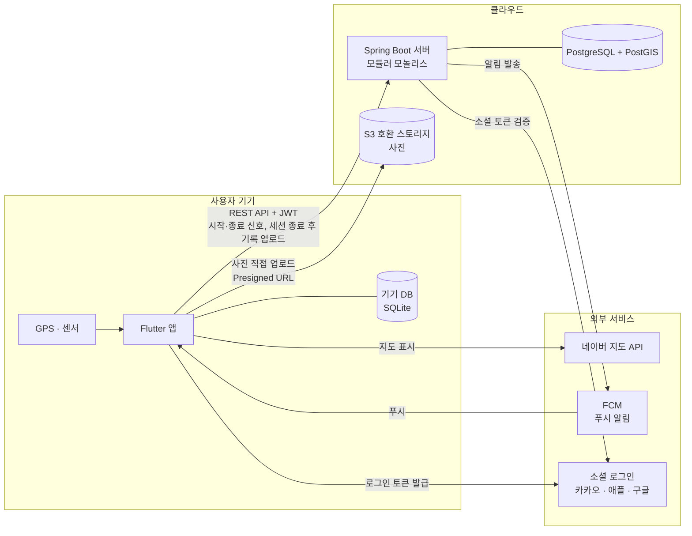
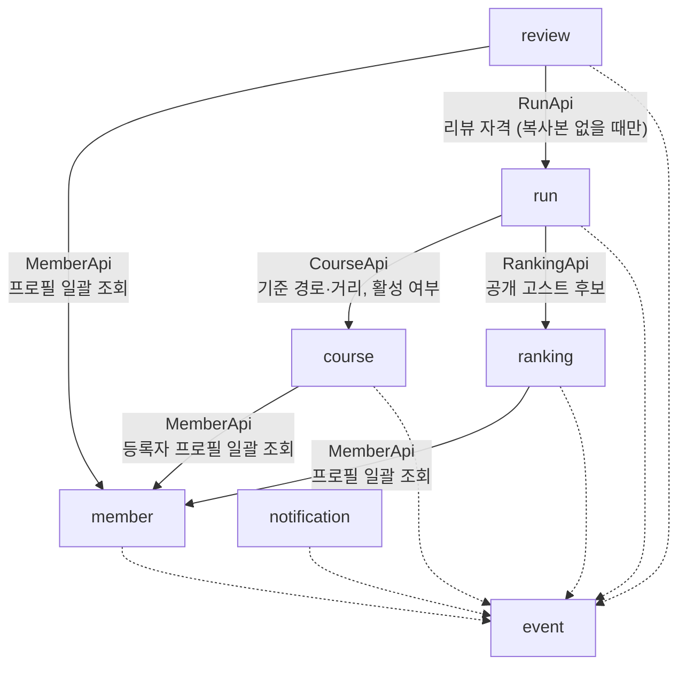
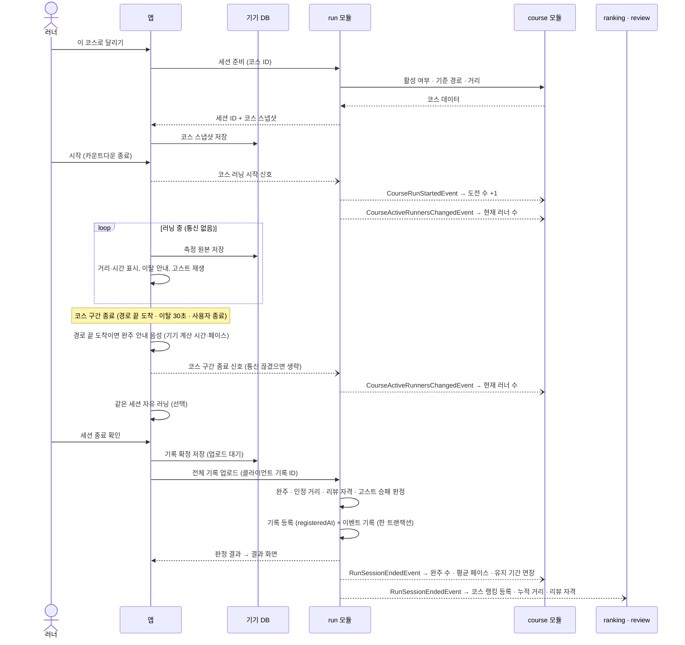
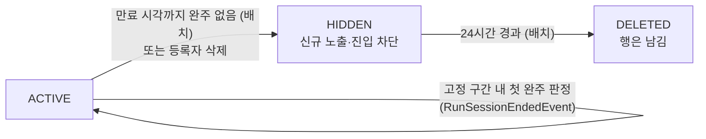

# 개발 정책 v3

상태: 최종 v3 · 작성일 2026-10-06 ·

> **문서 목적**: 서비스 전체 구조(앱·서버·DB·외부 서비스), 서버·앱의 내부 구조, 모듈 간 연동, DB, 이벤트, 핵심 흐름, 배포·확장, 협업 방식을 한곳에서 정한다.
> 기능 정책(무엇을 만들지)은 [`정책 문서.md`](정책%20문서.md)(최종 정책 2026-10-06)를 따르고, 이 문서는 **어떻게 만들지**만 다룬다. 달리기 세부 설계는 [`run/달리기 개발 아키텍처`](run/달리기%20개발%20아키텍처%20-%202026-10-06.md)에 있다.
>
> **전제 — 모놀리스로 시작해 MSA로 확장한다.**
> 지금은 서버 하나로 빠르게 만들고, 나중에 모듈 하나를 떼어낼 때 **비즈니스 코드 수정 없이 "이동 + 설정 변경"만으로** 끝나게 한다.
> 규칙이 애매할 때의 판단 기준은 하나다: **"이 모듈이 내일 다른 서버·다른 DB로 떨어져 나가도 그대로 동작하는가?"**

## 1. 아키텍처

### 1.1 설계 목표

| 순위 | 목표 | 근거 |
| --- | --- | --- |
| 1 | **러닝 기록은 잃지 않고, 랭킹에 반영할 완주는 서버만 판정한다** | 통신 끊김·앱 종료·다른 기능 오류와 무관하게 기록 보존. 완주 판정 권한은 서버에만 있음 (정책 공통 1, 달리기 개발 아키텍처 8장) |
| 2 | **오프라인에서도 측정이 된다** | 코스·고스트 데이터는 시작 전에 받아두고, 측정·저장은 기기에서 계속 (ERR-04, ERR-05) |
| 3 | **소규모 팀이 빠르게 만든다** | MVP 단계 → 운영 부담이 적은 구조 |
| 4 | **나중에 나눌 수 있다** | 부하가 큰 기능(run)을 별도 서버로 분리할 수 있게 경계를 지킨다 (11장) |

### 1.2 시스템 구성



| 구성 요소 | 역할 |
| --- | --- |
| Flutter 앱 | 화면, 지도, GPS 측정, 기기 저장·재전송, 거리·시간 표시, 이탈 안내, 고스트 재생, 음성 안내, **코스 구간 종료 결정·완주 안내**. 랭킹에 반영할 완주 여부는 판정하지 않는다 |
| 기기 DB | 러닝 중 측정 원본, 업로드 대기 기록, 시작 전 받아둔 코스·고스트 데이터 |
| Spring Boot 서버 | 모든 비즈니스 로직. **완주·코스 인정 거리·리뷰 자격·고스트 승패를 단독 판정**, 랭킹·통계 집계, 만료 배치 |
| PostgreSQL + PostGIS | 모든 영구 데이터, 지도 영역 조회·겹침 판정·선투영 계산 |
| S3 호환 스토리지 | 프로필·리뷰 사진. 앱이 Presigned URL로 직접 업로드 |
| 소셜 로그인 | **유일한 로그인 수단**(카카오·Apple·Google). member가 소셜 토큰을 검증하고 자체 JWT 발급 (7장) |
| 네이버 지도 API | 앱의 지도 표시 |
| FCM | 푸시 알림 전달(Android·iOS 공통). 서버가 FCM HTTP v1 API로 보내고, 앱은 기기 토큰을 서버에 등록한다 |

- 화면 갱신(현재 러너 수 등)은 앱이 주기적으로 조회한다. 화면용 실시간 연결(SSE·WebSocket)은 두지 않는다. 알림은 FCM 푸시로 보낸다.
- 배포 구성과 확장 경로는 8장.

### 1.3 기본 방향

- **모듈러 모놀리스**로 시작한다. 서버는 하나로 배포하고 내부를 도메인 모듈로 나눈다. (Spring Boot + Spring Modulith)
- **모듈 = 미래의 서비스**다. 모듈 경계는 지금부터 서비스 경계처럼 다룬다.
- DB는 PostgreSQL + PostGIS **1대**, 모듈별 **스키마**로 나눈다. **스키마 = 미래의 서비스별 DB**다.
- 분리는 필요할 때 한다. 미리 나누지 않는다. 시점과 대상은 11장 기준으로 정한다. 첫 후보는 `run`(GPS 부하·장애 격리)이다.

### 1.4 모듈 경계를 넘는 방법은 세 가지뿐

| 방법 | 모놀리스에서 | MSA 분리 후 |
| --- | --- | --- |
| 공개 인터페이스 호출 (`XxxApi`) | 메서드 호출 | HTTP 호출 — 호출 쪽에 **같은 인터페이스의 HTTP 구현체**를 넣는다 |
| 이벤트 (`event` 모듈 record) | Modulith 이벤트 + 아웃박스 | 메시지 브로커 (Modulith 이벤트 외부화) |
| ID 값 (`UUID`) | 컬럼에 값만 저장 | 그대로 |

- 이 셋 외의 공유는 모두 금지한다: 다른 스키마 테이블 조회·JOIN·FK, 엔티티 공유, 다른 모듈 내부 빈 주입, 인스턴스 메모리 공유 상태.
- 분리할 때 바뀌는 곳은 **"공개 인터페이스 구현체"와 "이벤트 전달 수단" 두 곳뿐**이어야 한다.

### 1.5 지금 하지 않는 것

- 서비스 디스커버리, API 게이트웨이, 메시지 브로커, 분산 트랜잭션(사가), 서비스별 DB 서버 — 분리 시점에 도입한다.
- Redis — MVP는 DB만으로 충분하다. 도입 조건은 8.3.
- 모듈별 데이터소스 분리, Gradle 멀티 프로젝트 — `verify()`와 이 문서의 규칙으로 대신한다.

### 1.6 주요 결정 기록

| 결정 | 이유 | 검토한 대안 |
| --- | --- | --- |
| 모듈러 모놀리스로 시작 | 소규모 팀·MVP. 운영 부담 최소 | 처음부터 MSA: 인프라·분산 디버깅 비용이 큼 |
| run을 첫 분리 후보로 | GPS 업로드·판정 부하가 크고 장애 격리 이점이 분명 | 처음부터 전부 분리 |
| DB 1대 + 모듈별 스키마, 모듈 간 FK 0개 | 비용·운영 단순, 분리 시 스키마째 이동 | 모듈별 DB: MVP에서는 과함 |
| 모듈 간 변경은 이벤트(아웃박스) | 다른 기능 오류가 러닝 기록 저장을 막지 않음, 유실 없음 | 직접 호출: 한 곳 실패 시 기록 저장까지 실패 |
| 이벤트 양식은 `event` 모듈에 | 모듈 간 순환 의존 방지 | 발행 모듈에 보관: 동기 호출과 겹쳐 순환 발생 |
| **랭킹 반영 완주는 서버 단독 판정, 앱은 완주 안내만** | 정책 공통 1. 랭킹·연장·리뷰 자격의 신뢰성 | 앱 판정을 랭킹에 반영: 오차·조작에 취약 |
| **러닝 중 통신 없음, 세션 종료 후 업로드** | 배터리·신호 약한 구간에 강함, API 단순. 코스 구간 종료는 앱이 정하고 완주는 서버가 판정 | 러닝 중 묶음 업로드: 통신 부담, 신호 끊김에 취약 |
| **현재 러너 수 = 시작·구간 종료 신호** | 러닝 중 통신 없이 집계. 신호 누락은 기록 업로드 또는 시간 경과로 제외 | 주기적 생존 신호: 통신 부담 |
| **오프라인은 자유 러닝만 시작** | 코스·고스트는 시작 스냅샷과 시작 신호(도전 수·러너 수)가 필요 | 오프라인 코스 시작 허용: 도전 수 날짜·러너 수 처리 복잡 |
| **판정용 웨이포인트 미사용** | 정책 공통 3. 선투영 + 출발·도착 GPS + 인정 거리 95%로 판정 | 웨이포인트 순서 통과: 폐기된 정책 |
| 코스·회원 논리 삭제 | 개인 기록 보존, 오프라인 업로드, 이벤트 기반 정리 | 실제 삭제 + CASCADE: 남의 기록까지 삭제됨 |
| 화면용 실시간 연결(SSE·WebSocket) 없음, 화면은 폴링 | 현재 러너 수 1분 갱신·랭킹 수동 갱신이면 충분. 다중 인스턴스 부담 없음 | SSE: 필요한 기능 없음 |
| 앱은 오프라인 우선 | 러닝 중 통신 끊김이 흔함 | 실시간 서버 전송 의존 |

## 2. 모듈 구성

| 모듈 | 소유 테이블 (스키마 = 모듈명) | 책임 | 분리 시 | 담당 |
| --- | --- | --- | --- | --- |
| common | event_publication, region(법정동 코드·이름·경계, 읽기 전용), shedlock | 공통 설정·응답·예외·페이징·인프라 | 공유 라이브러리(jar) | 이도현, 원세찬 (변경 리뷰는 전원) |
| event | 없음 | 모듈 간 이벤트 record (메시지 계약) | 계약 라이브러리(jar) | 이벤트를 발행하는 모듈 담당 |
| member | 회원, 소속 | 인증·JWT 발급, 프로필, 공개·검색 허용 설정 | member 서비스 | 이도현, 원세찬 (프로필·공개 설정: 이연주) |
| course | 코스, 저장한 코스, 코스 일별 통계, 현재 러너 수 복사본, 일일 등록 한도, 등록 멱등 키, processed_event | 코스 등록·조회·검색, 저장 코스, 유지 기간·만료, 코스 통계(도전 수·완주 수·조회 수·평점) | course 서비스 | 서현석 |
| run | 러닝 기록, GPS 스트림, 코스 주행 결과, 회원 공개 복사본, processed_event | 러닝 측정 저장, 완주·리뷰 가능 판정, 고스트 대결, 현재 러너 수 | run 서비스 (첫 후보) | 김효성, 문석용 |
| ranking | 코스 랭킹 엔트리, 누적 거리 집계, 전체·지역 랭킹 스냅샷, 코스 상태 복사본, 회원 공개 복사본, processed_event | 코스 랭킹, 누적 거리 랭킹, 공개 고스트 선택 | ranking 서비스 | 이도현, 원세찬 |
| review | 리뷰, 리뷰 자격, 코스 상태 복사본, processed_event | 리뷰 작성·수정·삭제, 평점 변경 이벤트 발행 | review 서비스 | 이도현, 원세찬 |
| notification | 기기 푸시 토큰, 알림 설정, 알림 발송 기록, processed_event | 푸시 알림 발송(FCM), 알림 설정. FCM 연동은 `PushSender`로 감싸고 로컬용 구현을 둔다 | notification 서비스 | 이연주 |

- 테이블은 **소유 모듈만 읽고 쓴다.**
- `event_publication`(Modulith 아웃박스)·`shedlock`(스케줄 락)은 인프라 테이블이다. 분리된 서비스는 각자 자기 DB에 같은 테이블을 가진다.
- **지역(region)** 은 거의 바뀌지 않는 참조 데이터다. 다른 모듈은 **법정동 코드 값만** 저장하고 FK를 걸지 않는다.
  - 시·도(앞 2자리)·시·군·구(앞 5자리) 단위로 묶어야 하면 그 단위 코드를 컬럼으로 함께 저장해 JOIN 없이 처리한다.
  - 좌표가 속한 법정동은 경계 데이터로 PostGIS가 판별한다(`RegionResolver`). 경계는 공공 법정동 경계 데이터(국가공간정보포털 AL_D001)를 단순화해 시드로 넣는다.
  - 판별은 좌표를 포함하는 읍·면·동, 없으면 약 100m 안의 가장 가까운 읍·면·동이다. 단순화로 생긴 이웃 동 사이 틈·경계선·해안 좌표도 판별하기 위해서이며, 더 멀면(바다) 빈 값이다.
  - 분리 시 지역 데이터가 필요한 서비스는 같은 데이터를 시드로 가진다.
- 뱃지·업적(E3)의 소유 모듈은 미정이다(12장).

## 3. 패키지·접근 제어

### 3.1 패키지 구조

```
com.wadadak
├── WadadakApplication.java
├── common/                         # OPEN 모듈 (하위 패키지까지 공개)
│   ├── package-info.java           # @ApplicationModule(type = Type.OPEN)
│   ├── config/ response/ exception/ paging/ outbox/ region/ geo/ entity/ stub/
├── event/                          # OPEN 모듈. 이벤트 record만
│   ├── package-info.java           # @ApplicationModule(type = Type.OPEN)
│   ├── IntegrationEvent.java       # 공통 필드 인터페이스 (eventId, occurredAt)
│   ├── course/                     # course가 발행하는 이벤트
│   │   ├── CourseCreatedEvent.java
│   │   ├── CourseStatusChangedEvent.java
│   │   └── CourseExpiringSoonEvent.java
│   ├── run/
│   ├── review/
│   └── member/
├── member/
├── course/
│   ├── CourseApi.java              # [공개] 다른 모듈이 호출하는 인터페이스
│   ├── CourseSummary.java          # [공개] DTO record
│   ├── CourseErrorCode.java        # [공개] 모듈 에러 코드
│   └── internal/                   # [비공개] 하위 구성은 자유
│       ├── Course.java             # 엔티티
│       ├── CourseRepository.java
│       ├── CourseService.java      # CourseApi 실제 구현
│       ├── CourseController.java
│       ├── CourseEventHandler.java # 다른 모듈 이벤트 수신
│       └── CourseApiStub.java      # CourseApi 스텁
├── run/
├── ranking/
├── review/
└── notification/
```

- 모듈 루트에는 **공개 인터페이스·DTO record·에러 코드 enum**만 둔다.
- `internal/` 아래는 자유롭게 하위 패키지로 나눠도 된다. 접근 제어는 Modulith가 한다(모듈 루트 외 하위 패키지는 비공개). package-private은 권장 사항이다.
- `common`·`event`는 `@ApplicationModule(type = ApplicationModule.Type.OPEN)`으로 선언해 하위 패키지를 공개한다. 선언하지 않으면 `common.exception.AppException`을 쓰는 순간 `verify()`가 실패한다. (사용하는 Modulith 버전이 OPEN을 지원하지 않으면 하위 패키지마다 `@NamedInterface`를 붙인다.)
- `common`·`event`는 **다른 어떤 모듈도 import하지 않는다.** 분리 시 독립 jar가 된다.
- 모듈 간 이벤트 record는 `event` 모듈에 모은다. 발행 모듈에 두면 받는 모듈이 발행 모듈에 의존하게 되고, 동기 호출과 겹쳐 순환 의존이 생긴다(`verify()` 실패, 분리 불가).
- 도메인 모듈끼리는 상대의 **모듈 루트 타입만** 쓴다. `internal` import 금지, 구현체 직접 참조 금지.
- 공개 인터페이스는 엔티티를 반환하지 않고 **DTO record만** 반환한다. 공개 DTO·enum은 다른 모듈이 import할 수 있게 **`public`으로 선언**한다(`public record ...`). `public`이 없으면 같은 패키지 안에서만 보여 다른 모듈에서 컴파일 오류가 난다.
- 여러 모듈이 함께 쓰는 도메인 무관 값 타입(좌표 `GeoPoint` 등)은 `common`에 둔다. 특정 모듈에 두면 그 타입 하나 때문에 다른 모듈이 그 모듈에 의존하게 되고, 순환 의존이나 분리 시 불필요한 의존이 생긴다.
- 공개 DTO는 **JSON으로 직렬화할 수 있어야** 한다(분리 후 HTTP 본문이 된다). 기본 타입·`UUID`·`Instant`·enum·record·`List`만 쓰고, 엔티티·지연 로딩 프록시·`Optional` 필드·람다·프레임워크 타입(`Pageable` 등)은 쓰지 않는다.
- 다른 모듈 엔티티를 `@ManyToOne` 등으로 참조하지 않는다. `UUID` 필드로만 보관한다.
- `ApplicationModules.verify()` 테스트를 CI에서 실행해 위반 시 빌드를 실패시킨다.

### 3.2 스텁(Stub) 구현체

공개 인터페이스를 만드는 계약 PR에 **고정값을 반환하는 스텁을 함께 커밋**한다. 실제 구현 전에도 다른 모듈 개발이 막히지 않게 한다.

모듈별 프로퍼티로 실제 구현과 스텁을 고른다.

```java
@Service
@ConditionalOnProperty(name = "app.stub.course", havingValue = "false", matchIfMissing = true)
class CourseService implements CourseApi { ... }

@Component
@ConditionalOnProperty(name = "app.stub.course", havingValue = "true")
class CourseApiStub implements CourseApi, StubImplementation { ... }
```

- **계약 PR**: `application.yml`에 `app.stub.{module}: true`를 추가한다. 실제 구현이 없어도 기동된다.
- **실제 구현 완료 PR**: 같은 값을 `false`로 바꾼다.
- 로컬에서 특정 모듈만 스텁으로 돌리려면 `application-local.yml`에서 그 모듈만 `true`로 둔다.
- 스텁에는 `@Primary`를 절대 붙이지 않는다.
- **운영 보호**: 스텁은 `common.stub.StubImplementation` 마커 인터페이스를 구현한다. `prod` 프로필에서 이 타입 빈이 하나라도 있으면 기동을 실패시킨다(`StubGuard`).
- 스텁 반환값은 공개 DTO 형식을 그대로 따른다. 실제 구현 머지 후에도 로컬 개발·모듈 단독 테스트용으로 유지한다.
- 스텁은 "다른 모듈 없이 내 모듈만 띄우기" 연습이다. 분리 후에는 같은 자리에 HTTP 구현체가 들어간다(11.3).

### 3.3 common 모듈 구성

`common/`에는 특정 도메인에 종속되지 않는 인프라·프레임워크 성격의 클래스만 둔다. 도메인 용어가 들어간 클래스는 두지 않는다. 분리 시 공유 라이브러리가 되므로 **상태(빈 사이 공유 데이터)를 갖지 않는다.**

| 분류 | 클래스 / 인터페이스 | 설명 |
| --- | --- | --- |
| 설정 | `WebConfig` | 커서 페이징 Resolver 등록 및 웹 관련 설정 |
|  | `SwaggerConfig` | OpenAPI 설정. **모듈별 그룹**(`GroupedOpenApi`)으로 나눈다 (7장) |
|  | `SecurityConfig` | Spring Security + JWT **검증** (발급은 member) |
|  | `TimeConfig` | `Clock` 빈 (Asia/Seoul). 기간 계산 테스트용 |
| 공통 응답 | `ApiResult` | 통일된 API 응답 Wrapper (v1 `ApiResponse` — Swagger `@ApiResponse`와 충돌해 개명) |
|  | `ResultType` | 응답 결과 상태 Enum |
| 예외 처리 | `AppException` | 비즈니스 커스텀 예외 기본 클래스 (`RuntimeException` 상속) |
|  | `ErrorCode` | 에러 코드 **공통 인터페이스** (`status`·`code`·`message`). 각 모듈은 구현 enum(`CourseErrorCode` 등)을 자기 모듈 루트에 둔다 |
|  | `CommonErrorCode` | 도메인과 무관한 공통 에러 (잘못된 요청, 인증 실패, 권한 없음, 서버 오류 등) |
|  | `GlobalExceptionHandler` | `@RestControllerAdvice` 기반 전역 예외 처리 |
| 커서 페이징 | `Cursorable` | 커서 기반 페이징 요청 객체 |
|  | `CursorableArgumentResolver` | Controller 파라미터 바인딩용 Resolver |
|  | `@CursorDefault` | 커서 페이징 기본값 지정 애너테이션 |
|  | `CursorSlice` | 커서 페이징 응답 (v1 `Slice` — Spring Data `Slice`와 충돌해 개명) |
| 아웃박스 | `EventRetryScheduler` | 미완료 이벤트 주기적 재전송 (5.5) |
|  | `EventMonitor` | 오래 밀린 이벤트 감지·알림 (5.5) |
| 스텁 | `StubImplementation`, `StubGuard` | 스텁 마커, 운영 환경 스텁 기동 차단 (3.2) |
| 공통 데이터 | `Region` | 지역(법정동) 읽기 전용 조회. 다른 모듈은 코드 값만 저장 (2장) |
|  | `GeoPoint` | 좌표 공개 DTO `public record GeoPoint(double lat, double lng)`. 모든 모듈의 공개 DTO·API 좌표에 쓴다 (7장) |
| 공통 템플릿 | `BaseEntity` | JPA 생성일(`createdAt`)·수정일(`updatedAt`) 공통 매핑 (`@MappedSuperclass`) |

## 4. 모듈 간 연동

### 4.1 기본 원칙

| 구분 | 같은 모듈 안 | 다른 모듈 사이 |
| --- | --- | --- |
| ID 저장 | O | O (값만) |
| FK 제약 | O | **금지** (지역 포함) |
| CASCADE / SET NULL | O | **금지** |
| JOIN·직접 조회 | O | **금지** — 공개 인터페이스 또는 복사본 |
| 상대 테이블에 쓰기 | O | **금지** — 이벤트로 요청 |
| 트랜잭션 공유 | O | **금지** — 각 모듈의 작업은 자기 트랜잭션에서 끝난다 |

- FK가 하던 "존재 확인"은 쓰는 시점에 공개 인터페이스나 복사본으로 한다. 이후 상대가 삭제·변경되면 이벤트로 정리한다(5.6).

### 4.2 조회 방법

| 상황 | 방법 | 예 |
| --- | --- | --- |
| 정렬·필터·검색 기준이 다른 모듈 값 | **내 테이블에 복사본** 보관, 이벤트로 갱신 | 코스 목록 인기순(도전 수)·평점, 랭킹·리뷰의 코스 노출 여부 |
| 원본이 사라져도 보여줘야 함 | **저장 시점에 복사**(스냅샷) | MY 기록의 당시 코스명·거리 |
| 표시만 하는 값 | **ID를 모아 한 번에 조회** 후 코드에서 합침 | 랭킹·리뷰 목록의 닉네임·사진, 코스 등록자(B1·G5) |
| 최신 상태가 반드시 필요 | 공개 인터페이스 **동기 호출** | 러닝 시작 시 코스 경로·활성 여부 |
| 여러 모듈 정보를 한 화면에 | 앱이 모듈별 API를 각각 호출 | 코스 상세(B1), MY(E3), 다른 러너 프로필(I3) |

- 한 건씩 반복 호출(N+1)은 금지한다. 공개 인터페이스에 일괄 조회 메서드(`getXxx(Set<UUID>)`)를 제공한다. 한 번에 최대 100개.
- 상대 데이터가 없을 수 있음(삭제·탈퇴, 분리 후 장애)을 전제로 처리한다.
- **표시용 조회는 소유 모듈이 공개 설정·탈퇴 처리를 적용한 값을 돌려준다.** 예: 탈퇴 회원 → `탈퇴한 사용자`. 호출하는 쪽은 판단하지 않는다.
- 복사본은 **최종 일관성**(수 초 지연)을 갖는다. 그 지연을 허용하는 곳에만 쓴다.

### 4.3 동기 호출 방향 (허용 목록)

| 호출자 | 대상 | 용도 |
| --- | --- | --- |
| run | CourseApi | 기준 경로·전체 거리 조회, 러닝 시작 시 코스 활성 여부 |
| run | RankingApi | 공개 고스트 후보 (기간별, 비공개 회원·요청자 본인 제외) |
| review | RunApi | 리뷰 작성 자격 조회 — 자격 복사본이 아직 없을 때만(세션 종료 직후 이벤트 도착 전) |
| ranking | MemberApi | 프로필 일괄 조회 (표시용) |
| review | MemberApi | 프로필 일괄 조회 (표시용) |
| course | MemberApi | 등록자 프로필 일괄 조회 (표시용: B1 코스 상세, G5 저장한 코스) |



- 실선은 동기 호출(공개 인터페이스, 조회 전용), 점선은 이벤트 양식 의존이다. 모든 모듈은 `common`에 의존한다(그림에서 생략).
- 호출 방향은 한쪽으로만 유지한다(**순환 없음**). 역방향 소통은 전부 이벤트로 한다. ranking·review의 코스 노출 여부도 동기 호출 대신 코스 상태 복사본을 쓴다.
- 목록에 없는 호출을 추가할 때는 대상 모듈 관리자와 합의하고 이 표와 그림을 같은 PR에서 수정한다.
- 추가하기 전에 **복사본으로 대신할 수 없는지** 먼저 본다. 동기 호출 하나는 분리 후 네트워크 의존 하나다.

### 4.4 동기 호출 규칙 (분리 대비)

분리 후에는 메서드 호출이 HTTP 호출이 된다. 지금부터 그렇게 다룬다.

- 공개 인터페이스는 **조회만** 제공한다. 다른 모듈의 데이터를 바꾸는 메서드는 공개하지 않는다(변경은 이벤트).
- 공개 인터페이스 구현은 자기 트랜잭션(`@Transactional(readOnly = true)`)으로 동작하고 호출자의 트랜잭션에 기대지 않는다.
- 동기 호출은 **쓰기 트랜잭션을 열기 전에** 한다. "다른 모듈 조회 → 내 트랜잭션 메서드 호출" 순서로 나눈다. 트랜잭션 안에서 호출하면 분리 후 네트워크를 기다리는 동안 DB 커넥션과 락을 잡고 있게 된다.
- 호출 실패를 처리한다.
  - 공개 인터페이스는 대상이 없거나 실패할 때 던지는 예외(`AppException` + 대상 모듈 `ErrorCode`)를 Javadoc에 적는다.
  - 표시용 조회가 실패하면 호출 쪽은 기본값으로 대신하고 화면 전체를 실패시키지 않는다.

### 4.5 완주 판정과 러닝 중 통신

**흐름 (코스 러닝 시작부터 랭킹 반영까지)**



**판정 위치**

| 처리 | 앱 | 서버 (run) |
| --- | --- | --- |
| 거리·시간·페이스 표시, 자동 랩 | 계산·표시 | 저장 결과로 재계산 |
| 이탈 후보·확정 안내 | **실시간** (표시용 선투영) | - |
| 코스 구간 종료 (경로 끝 도착·이탈 30초·사용자 종료) | **앱이 결정** | 종료 시점 이전 데이터로만 완주 판정 |
| 완주 안내 (경로 끝 도착 시 음성·자유 러닝 전환·대결 마감) | **앱 실시간** (기기 계산 시간·페이스) | - |
| 고스트 재생·격차 | **실시간** (총 소요시간 축) | - |
| 완주 여부 (출발·도착 GPS + 경로 끝 도달 + 코스 인정 거리 ≥ 전체 거리 × 95%) → 랭킹·고스트·연장 반영 | 판정하지 않음 | **단독 판정** |
| 코스 인정 거리·진행도, 리뷰 자격 | 판정하지 않음 | **단독 판정** (리뷰 자격은 종료·저장 후) |
| 고스트 승패·무효 | 판정하지 않음 | **단독 판정** |

**규칙**

- **완주 여부는 run 모듈만 판정한다.** 서버 완주 여부만 코스 랭킹·고스트 후보·유지 기간 연장·완주 수에 반영한다. 앱은 이를 판정하지 않는다.
- **러닝 중에는 서버와 통신하지 않는다.** 앱은 측정·기기 저장·표시·이탈 안내·고스트 재생을 혼자 처리한다.
- **코스 구간 종료는 앱이 정한다.**
  - 경로 끝 도착: **완주 안내**(완주 음성: 기기에서 계산한 코스 총 소요시간·코스 완주 페이스) 후 같은 세션 자유 러닝으로 전환. 고스트 대결도 이때 마감한다.
  - 이탈 확정 30초 지속·사용자 종료: 미완주로 구간 마감.
- **세션 종료 후 전체 기록을 한 번 업로드**한다. run은 구간 종료 시점 이전 데이터에서 완주 조건을 처음 충족한 시점을 찾아 완주 여부·완주 시각·코스 시간을 정한다. 결과 화면은 서버 값으로 표시한다. 앱이 완주 안내를 했어도 서버가 미완주로 판정하면 그대로 미완주이며 별도 처리하지 않는다.
- 서버의 완주 거리 기준(인정 거리 ≥ 95%)과 경로 끝 도달 허용 오차는 앱의 도착 감지보다 넉넉하게 잡는다. 코스를 제대로 달렸다면 앱 안내와 서버 판정이 어긋나지 않게 한다.
- **판정용 웨이포인트는 없다.** 지도의 1km 거리 표지는 표시용이며 판정에 쓰지 않는다(정책 공통 3).
- **오프라인에서는 자유 러닝만 시작할 수 있다.** 코스 러닝·고스트 대결은 시작 스냅샷 확보와 시작 신호가 성공해야 시작한다. 실패하면 "연결 실패"를 안내하고 시작하지 않는다. 시작 후 통신이 끊겨도 러닝은 계속한다.
- 짧은 신호는 두 개뿐이다: **코스 러닝 시작**(도전 수·현재 러너 수, 항상 온라인)과 **코스 구간 종료**(현재 러너 수, 러닝 중 통신이 끊겼으면 생략).
- 업로드가 실패하면 "기기에 저장됨 · 동기화 대기"로 두고 연결되면 재시도한다. 클라이언트 기록 ID로 중복을 막는다. 재업로드는 같은 결과를 돌려주고 기록 등록 시각을 바꾸지 않는다.
- 업로드 전 결과 화면은 기기에서 계산한 거리·시간·페이스를 보여주고 완주 여부·랭킹·리뷰 자격은 "판정 대기"로 표시한다. 업로드가 성공하면 서버 결과로 바꾼다.
- 이 절의 기능 규칙(오프라인 시작, 완주 안내, 현재 러너 수)은 정책 문서 제4부 4.1·4.2에 둔다. 아래 두 가지는 확정 정책과 달라 제4부 4.2에서 협의 중이다.
  - "앱이 완주 안내·구간 종료를 한다"는 정책 RUN-08·AUD-06(서버 완주 확정 후 전환·음성)과 다르다.
  - 정책의 "통신 90초 단절 시 코스 마감"(ERR-04)은 러닝 중 통신하지 않는 이 구조에 맞지 않아 삭제를 협의한다.

## 5. 이벤트 정책

### 5.1 방식

- 다른 모듈 데이터 변경은 **이벤트**로 요청한다. 발행 모듈은 "무슨 일이 일어났는지"만 알리고, 받는 모듈이 자기 테이블을 바꾼다.
- Spring Modulith **이벤트 발행 저장소(아웃박스)** 를 사용한다. 데이터 저장과 이벤트 기록이 같은 트랜잭션으로 묶여 유실되지 않는다.
- 이벤트 record는 **메시지 계약**이다. 분리 후 그대로 브로커 메시지가 된다(5.7). 계약 변경은 API 변경과 같은 무게로 다룬다.

### 5.2 처리 순서

1. 발행 모듈 서비스(트랜잭션 ①): 자기 데이터 저장 → 이벤트 발행 → Modulith가 수신자별로 아웃박스 기록 → 커밋 → 사용자 응답
2. Modulith: 커밋 후 수신 리스너를 비동기로 각각 실행
3. 수신 모듈 리스너(트랜잭션 ②, 리스너마다 별도): 중복 확인 → 자기 데이터 변경 → 커밋 → 완료 표시
4. 실패한 리스너만 미완료로 남고 재시도한다. 다른 리스너와 발행 쪽 저장은 영향받지 않는다.

### 5.3 이벤트 설계 규칙

- 이벤트는 반드시 **`@Transactional` 서비스 메서드 안에서** 발행한다. 트랜잭션 밖에서 발행하면 조용히 유실된다.
- 위치는 `event/{발행 모듈}/` 패키지, 이름은 과거형 사실: `RunSessionEndedEvent`, `CourseStatusChangedEvent`.
- **공통 필드**: 모든 이벤트는 `IntegrationEvent`를 구현하고 `eventId`(UUID, 발행 시 생성)·`occurredAt`(`Instant`)을 가진다.
- **메시지 키**: 이벤트마다 "같은 대상의 이벤트끼리 순서가 중요한 기준 ID"를 정해 5.6 표에 적는다. 브로커 전환 시 파티션 키가 된다.
- **정책 버전**: run이 판정 결과를 담아 보내는 이벤트(`RunSessionEndedEvent`)는 판정에 쓴 `policyVersion`을 담는다. 판정 기준이 바뀌어도 어느 기준의 결과인지 구분한다.
- **필요한 데이터를 담는다**: 수신자가 처리하려고 발행 모듈을 다시 조회해야 한다면 필드가 부족한 것이다.
  - 예: `RunRecordDeletedEvent`는 ranking이 누적 거리를 차감할 수 있게 거리·종료 시각을 담는다.
- 필드 타입: `UUID`·숫자·문자열·boolean·`Instant`·enum·`List`. 다른 모듈 타입은 import하지 않고, 필요한 enum은 `event` 모듈 안에 정의한다.
- **상태형 이벤트**("무엇이 어떤 상태가 됐다")는 원본 엔티티의 `version`(`@Version` 값)을 담는다.
- **집계형 이벤트**("수량이 바뀌었다")는 결과 값이 아니라 **증감 계산에 필요한 값**을 담는다. 증감은 도착 순서와 무관하게 합이 같다.
- **호환성**: 필드는 **추가만** 한다. 이름 변경·삭제·의미 변경이 필요하면 새 이벤트(`...V2`)를 만들고 수신자를 옮긴 뒤 이전 이벤트를 지운다. 역직렬화는 모르는 필드를 무시하도록 설정한다.

### 5.4 수신 규칙

- 리스너는 `@ApplicationModuleListener`를 사용한다(비동기 + 별도 트랜잭션).
- 같은 이벤트가 **두 번 이상 오거나 순서가 바뀌어 와도 결과가 같아야 한다.**

| 유형 | 방법 | 예 |
| --- | --- | --- |
| 삽입형 | 원천 ID에 유니크 제약 | 코스 랭킹 엔트리 `record_id` PK, 리뷰 자격 `(member_id, record_id)` |
| 증감형 | `processed_event`에 `(event_id, listener)`를 **트랜잭션 첫 단계에서** `INSERT ... ON CONFLICT DO NOTHING`, 0행이면 종료 | 도전 수, 누적 거리, 평점 합계 |
| 상태 복사형 | 저장된 `source_version`보다 큰 버전만 반영 (`ON CONFLICT ... DO UPDATE ... WHERE source_version < EXCLUDED.source_version`) | 코스 상태 복사본 |
| 삭제형 | 원래 멱등 | 저장 코스 제거 |

- `processed_event` 기록을 **맨 먼저** 하는 이유: 재전송으로 같은 이벤트가 동시에 처리되면, 두 번째 처리는 유니크 인덱스에서 첫 번째 커밋을 기다린 뒤 0행으로 끝난다. 마지막에 확인하면 둘 다 통과할 수 있다.
- 증감은 **원자적 UPDATE**(`SET count = count + :delta`)로 한다. 읽고 더해서 저장하면 동시 처리 때 값이 유실된다.
- 상태 복사본에 행이 없으면 원본 기본 상태(코스는 `ACTIVE`)로 본다.
- 리스너는 자기 모듈 테이블만 변경한다.
- 리스너에서 발행 모듈을 다시 호출하지 않는다. 필요하면 이벤트에 필드를 추가한다.
- 리스너 하나는 이벤트 하나만 처리한다. 리스너 이름은 `processed_event` 키로 쓰이므로 바꾸지 않는다.

### 5.5 재시도·모니터링

- **단일 인스턴스 동안**: 재시작 시 미완료 이벤트 재전송을 켠다.
- 공통 스케줄러가 1분마다 5분 이상 미완료된 이벤트를 재전송한다(`IncompleteEventPublications`). **ShedLock**으로 한 인스턴스에서만 실행한다.
- **인스턴스를 여러 대로 늘리면** 재시작 재전송은 끄고 스케줄러로 일원화한다. 다른 인스턴스가 처리 중인 이벤트까지 다시 보내는 것을 막는다.
- 10분 이상 밀린 이벤트가 있으면 알림을 보낸다(초기에는 로그 경고, 이후 메신저 알림).
- 완료된 이벤트 기록은 삭제해 테이블이 커지지 않게 한다(Modulith 완료 처리 모드를 삭제로 설정).
- 같은 이벤트가 반복해서 실패하면 알림 후 원인을 고쳐 수동으로 재처리한다.
- 사용하는 Modulith 버전에 재전송·지연 감지 기능이 내장돼 있으면 직접 구현보다 그것을 우선한다(F0에서 확인).

### 5.6 이벤트 목록

| 이벤트 | 발행 | 키 | 주요 필드 (공통 필드 제외) | 수신 · 처리 |
| --- | --- | --- | --- | --- |
| CourseRunStartedEvent | run | courseId | runSessionId, courseId, memberId | course: 도전 수 +1 |
| RunSessionEndedEvent | run | runRecordId | runRecordId, memberId, courseId(자유 러닝이면 null), completed, distanceMeters, courseElapsedSeconds(코스 총 소요시간, 정수 초), courseDistanceMeters, recognizedDistanceMeters, progress, reviewEligible, completedAt, startedAt, endedAt, registeredAt(기록 등록 시각), policyVersion | course: 완주 시 완주 수 +1·페이스 계산용 시간·거리 합계 +·유지 기간 연장(30일 고정 구간당 1회, 완주자 무관) / ranking: 코스 랭킹 등록(완주 시)·누적 거리 + (둘 다 기간 귀속은 registeredAt) / review: 리뷰 자격 저장 |
| RunRecordDeletedEvent | run | runRecordId | runRecordId, memberId, courseId, completed, distanceMeters, courseElapsedSeconds, endedAt, registeredAt | course: 통계 처리(정책 D-15) / ranking: 코스 랭킹 엔트리 삭제, 누적 거리 − / review: 그 기록으로 얻은 리뷰 작성 자격 삭제. 이미 작성된 리뷰·저장된 최고 진행도는 유지(정책 공통 5) |
| CourseActiveRunnersChangedEvent | run | courseId | courseId, activeCount, version | course: 현재 러너 수 복사본 갱신(상태 복사형) → 실시간순 정렬. run은 시작·종료 신호와 자동 제외 작업으로 수를 바꿀 때 발행 |
| CourseCreatedEvent | course | courseId | courseId, creatorId, sourceRunRecordId(기록에서 등록 시) | run: 원본 기록에 "코스 등록됨" 표시 |
| CourseStatusChangedEvent | course | courseId | courseId, status(`HIDDEN`/`DELETED`), reason(`EXPIRED`/`USER_DELETED`), version | ranking·review: 코스 상태 복사본 갱신 → `HIDDEN`이면 노출 중지, `DELETED`면 해당 코스의 랭킹 엔트리·리뷰·리뷰 자격 삭제(정책 공통 4) |
| CourseExpiringSoonEvent | course | courseId | courseId, creatorId, courseName, expiresAt, daysLeft(7 또는 1) | notification: 등록자의 `내 코스 만료 임박` 설정이 켜져 있으면 푸시 발송. 같은 `(courseId, expiresAt, daysLeft)`는 한 번만 보낸다(알림 발송 기록 유니크, 삽입형). course 만료 배치가 매일 오전 9시(Asia/Seoul)에 D-7·D-1 코스를 찾아 발행(정책 공통 4) |
| ReviewCreatedEvent | review | courseId | reviewId, courseId, rating, createdAt(리뷰 작성 시각) | course: 평점 합계 +rating, 리뷰 수 +1 |
| ReviewUpdatedEvent | review | courseId | reviewId, courseId, oldRating, newRating, createdAt(리뷰 작성 시각) | course: 평점 합계 +(newRating − oldRating) |
| ReviewDeletedEvent | review | courseId | reviewId, courseId, rating, createdAt(리뷰 작성 시각) | course: 평점 합계 −rating, 리뷰 수 −1 |
| MemberWithdrawnEvent | member | memberId | memberId, withdrawnAt | run·review·ranking: 해당 회원 데이터 처리(정책 따름) / course: 탈퇴 회원의 저장 코스 삭제. 등록한 코스는 유지(등록자 표시는 MemberApi가 `탈퇴한 사용자`로 반환, 정책 공통 4) / notification: 기기 토큰·알림 설정 삭제 |
| MemberVisibilityChangedEvent | member | memberId | memberId, visible, version | ranking: 회원 공개 복사본 갱신(상태 복사형) → 비공개 회원은 코스 랭킹·누적 거리 랭킹의 목록·순위 계산과 공개 고스트 후보에서 제외 / run: 회원 공개 복사본 갱신 → 비공개 회원의 기록을 다른 회원에게 내주지 않음(정책 공통 6) |

- 코스 평균 페이스는 거리·시간 **합계**를 저장해 조회 시 계산한다. 평균값을 직접 갱신하지 않는다(증감형 유지).
- **기간 정렬(정책 FIL-09)**: course는 도전 수·조회 수·평점 합계·리뷰 수를 **코스 일별 통계**(Asia/Seoul 날짜 단위)에도 증감해 기간 합계로 정렬한다. 날짜는 이벤트의 `occurredAt` 기준이다. 단, 리뷰 이벤트(`ReviewCreatedEvent`·`ReviewUpdatedEvent`·`ReviewDeletedEvent`)의 평점 합계·리뷰 수 증감은 **`createdAt`(리뷰 작성 시각)의 날짜**에 반영한다. 수정·삭제를 수정·삭제한 날짜에 반영하면 그 날짜의 평점 합계만 바뀌고 리뷰 수는 그대로여서 기간 평점이 틀어진다(예: 작성일 +5·1건, 수정일 −2·0건). 코스 카드의 평점은 전체 기간 값이다.
- **유지 기간 연장 시각**: 정책은 "만료 후 도착한 완주 이벤트는 연장하지 않는다"이다. 완주 판정이 세션 종료 업로드 후라서 만료 직전에 완주하고 늦게 업로드하면 연장되지 않는다(정책대로). 연장 여부는 이벤트의 `registeredAt`(서버 등록 시각)이 만료일 다음 날 00:00(배타)보다 이전이고 수신 시점의 코스 상태가 `ACTIVE`일 때만 연장으로 판단한다. 이미 `HIDDEN`/`DELETED`이면 복구 없이 무시한다(정책 D-10).
- v1의 `CourseHiddenEvent`·`CourseDeletedEvent`는 `CourseStatusChangedEvent`로 합쳤다. 코스 상태는 `ACTIVE → HIDDEN → DELETED` 한 방향으로만 바뀐다(숨김 해제·삭제 취소 없음, 정책 공통 4). 그래서 `ACTIVE`로는 발행하지 않고, `DELETED`로 바뀔 때도 `HIDDEN`이 된 사유(`EXPIRED`·`USER_DELETED`)를 그대로 싣는다. `status`·`reason`은 `event/course`의 enum(`CourseStatus`·`CourseStatusReason`)이다.
- 이벤트를 추가·변경하면 이 표를 같은 PR에서 수정한다.
- 다른 모듈 ID 컬럼을 새로 추가하면 "그 ID가 사라지거나 바뀔 때 받아야 할 이벤트"를 이 표에서 확인한다. 없으면 발행 모듈 관리자와 이벤트를 추가한다.

### 5.7 외부 메시지 브로커 전환 (분리 시)

- 지금은 도입하지 않는다.
- 분리할 모듈이 생기면 Spring Modulith **이벤트 외부화**(`@Externalized` + Kafka·AMQP 연동 모듈)로 관련 이벤트를 브로커에도 발행한다. 모놀리스 안의 수신자는 그대로 두고 브로커 수신을 추가할 수 있어 단계적으로 전환된다.
- 토픽은 발행 모듈 단위(`wadadak.course`, `wadadak.run` …), 메시지 키는 5.6의 키를 쓴다.
- 브로커는 "최소 1회 전달"이 기본이므로 5.4의 멱등 규칙이 그대로 안전장치가 된다.
- 브로커 종류(Kafka / RabbitMQ / 클라우드 큐)는 분리 시점에 정한다.

## 6. DB 정책

### 6.1 스키마·ID·타입

- 모듈별 스키마: `common`, `member`, `course`, `run`, `ranking`, `review`, `notification`. 엔티티는 `@Table(schema = "...")`를 명시한다.
- **스키마 경계를 넘는 SQL 금지**: 네이티브 쿼리·뷰·함수·트리거 모두 포함한다. SQL에 다른 모듈 스키마 이름이 나오면 위반이다.
- PK는 UUID(v7, 인덱스 단편화 방지). **애플리케이션에서 생성**한다. 저장 전에 ID를 알아야 이벤트·멱등 키에 쓸 수 있고, 분리 후에도 ID 체계가 그대로다. 지역은 법정동 코드 자연키.
- 시각은 `TIMESTAMPTZ` / Java `Instant`로 저장하고 JDBC 시간대는 UTC로 둔다. 기간 계산(만료일 23:59:59, 이번 주·이번 달)은 **Asia/Seoul** 기준이며 `Clock` 빈을 주입해 쓴다.
- 모든 엔티티는 `BaseEntity`(생성일·수정일)를 상속한다.
- 상태형 이벤트를 발행하는 엔티티는 `@Version`을 가진다(5.3).

### 6.2 삭제·만료

**코스 상태**



- **코스**: 논리 삭제. 상태 `ACTIVE / HIDDEN / DELETED`. 24시간 유예 후 "삭제"는 상태를 `DELETED`로 바꾸는 것이며 행은 남긴다. 자동 만료·사용자 삭제 확정 시 즉시 `HIDDEN`(reason `EXPIRED`·`USER_DELETED`)으로 바꾸고 24시간 뒤 `DELETED`로 바꾼다(정책 공통 4). `DELETED`가 되면 그 코스의 누적·일별 통계와 저장 코스도 함께 지운다. 상태가 바뀔 때마다 `CourseStatusChangedEvent`를 발행한다.
  - **유지 기간**: 등록일 포함 30일. 등록일부터 30일씩 **고정 구간**으로 나누고, 구간 안에서 서버가 확정한 첫 완주로 현재 만료일에서 30일 연장한다. 같은 구간의 추가 완주로는 다시 연장하지 않는다(완주자 무관, 정책 공통 4).
  - 숨김·삭제 전에 이미 시작한 러닝은 시작 시 받은 스냅샷으로 계속 진행하고, 결과는 개인 기록으로만 보존한다.
- **회원 탈퇴**: 상태 `WITHDRAWN` + 개인정보(닉네임·이메일·사진 등) 익명화. 행은 남긴다. `MemberWithdrawnEvent`를 발행한다. 탈퇴 회원이 등록한 코스는 지우지 않는다(정책 공통 4).
- **러닝 기록**: run 모듈 안에서 실제 삭제 가능(같은 모듈 CASCADE 허용) + `RunRecordDeletedEvent` 발행. 다른 모듈이 FK로 묶여 있지 않으므로 삭제가 막히지 않는다.
- 논리 삭제 테이블은 조회 시 상태 조건을 기본으로 건다. 삭제된 데이터를 봐야 하는 화면(MY·복구 등)이 있는 엔티티는 우회가 어려운 `@SQLRestriction` 대신 리포지토리 메서드 조건이나 Hibernate `@Filter`를 쓴다.
- 유니크·공간 인덱스는 활성 행만 대상으로 하는 부분 인덱스를 사용한다. (예: 코스 이름 `WHERE status = 'ACTIVE'`)

### 6.3 인덱스

- 다른 모듈 ID 컬럼(`member_id`, `course_id` 등)에는 **직접 인덱스를 만든다.** FK가 없으므로 아무것도 자동으로 생기지 않는다.
- 랭킹·목록처럼 정렬 조회가 있는 곳은 정렬 순서까지 포함한 복합·부분 인덱스를 둔다.

### 6.4 공간 데이터

- SRID는 4326.
- **코스 방향 = 기준 경로(LineString)의 좌표 순서**(첫 점이 출발, 마지막 점이 도착)다. 코스마다 방향은 하나이며 역방향 주행은 없다. 방향 필드를 따로 두지 않는다. 정책의 "동일 방향"(고스트)·"지정된 방향"(경로 판정)은 이 순서를 뜻한다.
- **반경·거리 검색 대상 컬럼**(코스 시작점 등)은 `geography`로 저장하고 GiST 인덱스를 건다. `ST_DWithin(geog, :point, :meters)`처럼 미터 단위로 바로 검색한다.
- 경로 판정처럼 geometry 함수가 필요한 계산(`ST_LineLocatePoint` 등)은 대상 행에서 `::geometry`로 변환해 쓴다. 행 단위 계산이라 인덱스가 필요 없다.
- geometry 컬럼을 `::geography`로 변환해 검색하면 GiST 인덱스를 타지 않는다. 불가피하면 같은 식으로 표현식 인덱스를 만든다.
- 대용량 컬럼(GPS 스트림)은 별도 테이블로 분리하고 목록 조회는 DTO projection을 사용한다.

### 6.5 마이그레이션

- Flyway를 사용하고 **모듈별 폴더**에 둔다: `db/migration/{module}/`.
- 파일 하나는 **스키마 하나만** 다룬다. 두 스키마를 건드리는 마이그레이션은 금지한다.
- 파일명은 타임스탬프 버전 + 모듈명: `V20261002_1430__course_add_daily_stat.sql`.
- 브랜치 머지 순서와 버전 순서가 어긋날 수 있으므로 `out-of-order`를 켠다.
- 한 번 머지된 마이그레이션 파일은 수정하지 않는다. 변경은 새 파일로 한다.
- 지금은 Flyway 하나, 이력 테이블 하나(`common` 스키마)로 운영한다. 분리 시 해당 모듈 폴더를 새 서비스로 옮기고 그 시점 버전으로 baseline한다(11.3).

## 7. API 정책

- 응답은 `ApiResult`로 감싼다.
- **URL은 모듈별 prefix**를 쓰고, 한 prefix는 한 모듈만 쓴다. 분리 후 API 게이트웨이가 prefix로 라우팅한다.

| prefix | 모듈 | 예 |
| --- | --- | --- |
| `/api/v1/members` | member | `/api/v1/members/me` |
| `/api/v1/courses` | course | `/api/v1/courses/{id}`, `/api/v1/courses/bookmarks` |
| `/api/v1/runs` | run | `/api/v1/runs/me` |
| `/api/v1/rankings` | ranking | `/api/v1/rankings/courses/{courseId}` |
| `/api/v1/reviews` | review | `/api/v1/reviews?courseId=...` |
| `/api/v1/notifications` | notification | `/api/v1/notifications/tokens`, `/api/v1/notifications/settings` |

- 다른 모듈 자원에 딸린 데이터라도 **소유 모듈의 prefix**를 쓴다. 코스 리뷰는 `/courses/{id}/reviews`가 아니라 `/reviews?courseId=`다.
- Swagger는 **모듈별 그룹**으로 나눈다. 분리 후 서비스별 명세와 같은 단위다.
- 에러 코드는 공통 인터페이스를 두고 **모듈별 enum**(`CourseErrorCode`, `RunErrorCode` …)으로 나눈다. 코드 문자열에 모듈 접두사를 붙인다(`COURSE-001`). 단일 enum에 모으지 않는다(머지 충돌 방지, 분리 후 코드 중복 방지). 코드 목록은 이 문서에 옮기지 않고 각 모듈의 `{Module}ErrorCode`가 기준이다(예: `BackEnd/src/main/java/com/wadadak/course/CourseErrorCode.java`).
- 목록은 커서 페이징(`Cursorable`, `CursorSlice`)을 사용한다.
- **좌표는 `{"lat": .., "lng": ..}` 객체로 주고받는다**(공개 DTO는 `common`의 `GeoPoint(lat, lng)`, 경로는 그 목록). 배열·GeoJSON 순서(`[lng, lat]`)는 API에 쓰지 않는다. PostGIS 변환(`ST_MakePoint(lng, lat)`)은 서버 내부에서만 한다.
- **사진 업로드**(리뷰·프로필): 앱이 업로드 URL을 요청하면 서버가 형식(`image/jpeg`만)·크기(50MB 이하)를 확인하고 `{module}/{uuid}.jpg` 키로 S3 Presigned POST를 발급한다. 크기 제한은 POST 정책의 `content-length-range`로 건다(Presigned PUT은 크기를 강제하지 못한다). 앱은 긴 변 2048px·품질 80~85의 JPEG로 변환하고 EXIF를 지운 뒤 S3에 직접 올리고, 리뷰·프로필 저장 요청에 키를 담는다. 서버는 키의 모듈 경로와 파일 존재를 확인한 뒤 저장한다. 모듈은 자기 스키마에 키만 두고, 리뷰 삭제·회원 탈퇴 시 파일도 지운다.
- 러닝 기록 업로드·코스 등록처럼 재시도 가능한 쓰기는 **멱등 키**를 받는다(러닝 기록: 클라이언트 기록 ID, 코스 등록: 등록 요청 키). 멱등 키는 해당 모듈 스키마에 저장한다. 코스 등록 키의 형식·보관·재요청 처리는 10.2 course 절에 둔다.
- 백엔드는 Swagger 명세를 먼저 머지하고, 앱은 명세를 기준으로 연동한다.
- **로그인은 소셜 로그인만 허용한다(카카오·Apple·Google).** 자체 아이디·비밀번호는 두지 않는다. 앱이 소셜 토큰을 받고, member가 검증한 뒤 자체 JWT를 발급한다.
- **인증은 JWT, 비대칭 서명(RS256 등)** 으로 한다.
  - member가 개인키로 발급하고, 나머지는 공개키로 검증만 한다. 분리 후 각 서비스(또는 게이트웨이)가 member를 호출하지 않고 토큰을 검증한다.
  - 토큰의 `sub`는 `memberId`다. 다른 모듈은 회원 식별을 위해 member를 호출하지 않는다.

## 8. 실행 환경·배포

### 8.1 실행 규칙 (수평 확장·분리 대비)

- **무상태 서버**: 요청 사이의 상태를 서버 메모리에 두지 않는다(세션 없음, JWT). 인스턴스를 여러 대로 늘려도 동작해야 한다.
- **인스턴스 메모리 공유 상태 금지**: "현재 러너 수"처럼 여러 요청이 함께 보는 값은 DB에 둔다. 로컬 캐시는 지연을 허용하는 읽기에만 쓴다.
- **스케줄 작업**: 소유 모듈 안에 둔다(만료 배치 = course). ShedLock으로 한 번만 실행한다.
- **설정 키**: 모듈별 `app.{module}.*`. 다른 모듈 설정을 읽지 않는다. 분리 시 설정을 모듈 단위로 떼어낸다.
- **관측**: 로그에 traceId(Micrometer Tracing)를, 이벤트 처리 로그에 eventId를 남긴다. 요청 수·지연·DB 시간 지표에 **모듈 태그**를 붙여 지금부터 모듈별로 수집한다(11.1 분리 판단 근거).

### 8.2 배포 구성 (MVP)

| 항목 | 구성 |
| --- | --- |
| 서버 | 1대 (Docker 이미지로 배포) |
| DB | 관리형 PostgreSQL 1대 + PostGIS, 모듈별 스키마 |
| 파일 | S3 호환 오브젝트 스토리지 |
| 로컬 개발 | Docker Compose로 PostGIS 실행 |
| CI | GitHub Actions: 빌드, 테스트(Testcontainers), `verify()`, 모듈 단독 기동 테스트 |

### 8.3 확장 경로

| 단계 | 시점 | 변경 |
| --- | --- | --- |
| 1 | MVP | 서버 1대, DB 1대 |
| 2 | 동시 접속이 늘 때 | 서버 여러 대 + 로드밸런서. 배치·재시도 스케줄은 ShedLock으로 한 대에서만 실행 |
| 3 | run 부하가 다른 기능에 영향을 줄 때 | run을 별도 서비스로 분리 (기준·절차는 11장) |
| 4 | 실제 지표를 보고 | ranking 등 추가 분리 검토 |

- **Redis 도입 조건**: 아래 중 하나가 생기면 도입한다.
  - 서버를 여러 대로 늘리면서 인스턴스 사이에 공유할 값이 생길 때 (요청 횟수 제한, 토큰 차단 목록 등)
  - 조회 수·현재 러너 수 갱신으로 DB 행 잠금 대기가 지표(8.1)에 보일 때 (12장 조회 수 메모)
- 도입해도 Redis에는 **DB에서 다시 채울 수 있는 값만** 둔다. 원본은 DB다. 키는 `{module}:...`(예: `course:views:{courseId}`)로 쓰고 다른 모듈 키는 읽거나 쓰지 않는다. ShedLock·아웃박스는 트랜잭션과 묶여야 하므로 DB에 그대로 둔다.

## 9. 앱 구조 (Flutter)

구조와 진행 상황은 [FrontEnd README](FrontEnd/README.md)를 기준으로 한다.

- 지도 SDK: **네이버 지도 API**

```
FrontEnd/
├── app/lib/
│   ├── core/          # API 클라이언트, 인증, 위치, 지도, 사진 업로드, 푸시, 공통 오류·빈 상태 화면
│   └── features/      # Figma 디자인 페이지 섹션 단위
│       ├── onboarding/
│       ├── home/      # 홈·코스 탐색·검색
│       ├── course/    # 코스 상세·만들기
│       ├── run/       # 달리기 준비·러닝 중·결과·분석
│       ├── ranking/
│       ├── review/
│       └── my/
└── packages/wadadak_design_system/
```

- MY 설정 중 기기 동작 설정(오디오 안내 등)은 **기기에만** 저장한다. 내 정보 공개·프로필 검색 허용은 member, 알림 설정은 notification(서버)에 저장한다.
- 앱은 **서버 주소 하나(base URL)** 만 안다. 모듈별 호스트를 두지 않는다. 분리 후에도 게이트웨이가 같은 경로를 받으므로 앱은 수정하지 않는다.
- `core/`의 API 클라이언트는 서버 모듈 prefix 단위로 나눈다(`CourseApiClient` → `/api/v1/courses`). 서버 Swagger 그룹과 1:1이다.
- 여러 모듈 정보를 한 화면에 보일 때는 앱이 각각 호출해 합친다(4.2). 한 API가 실패해도 화면 전체가 막히지 않게 영역별로 오류를 처리한다.
- **run은 측정을 화면 생명주기와 분리한다.** 화면을 이동하거나 지도를 숨겨도 수집·기기 저장이 계속된다. 내부 구성(Recorder·SyncWorker 등)은 [`run/달리기 개발 아키텍처`](run/달리기%20개발%20아키텍처%20-%202026-10-06.md) 3장.
- 기능 슬라이스 담당자가 해당 앱 폴더를 맡는다. `core/` 변경은 전원 리뷰 대상이다.
- 화면 코드에는 색·간격·글꼴 값을 직접 쓰지 않고 디자인 시스템 토큰·위젯만 쓴다.

## 10. 협업

### 10.1 기능 슬라이스

- 개발은 **기능 단위**로 나눈다. 한 명이 기능 하나를 API·도메인·DB·앱 화면까지 구현한다.
- 역할 분담: 온보딩·리뷰·랭킹 — 이도현, 원세찬 / 러닝 — 김효성, 문석용 / 코스 — 서현석 / MY·알림 — 이연주
- 모듈마다 **모듈 관리자** 1명을 둔다. 모듈 관리자는 그 모듈의 공개 영역(인터페이스·DTO·에러 코드·발행 이벤트)과 스키마 변경을 승인한다.

| # | 기능 | 주요 모듈 | 담당 |
| --- | --- | --- | --- |
| F0 | 골격·인증·온보딩 | common, member | 이도현, 원세찬 |
| F1 | 코스 등록(직접) | course | 서현석 |
| F2 | 코스 탐색 | course | 서현석 |
| F3 | 코스 상세 | course (+review, ranking 조회는 앱에서 조합) | 서현석 |
| F4 | 검색 | course, member | 서현석 |
| F5 | 자유 러닝·기록 저장·오프라인 업로드 | run | 김효성, 문석용 |
| F6 | 코스 러닝(경로 판정·이탈·오디오·완주) | run | 김효성, 문석용 |
| F7 | GPS 코스 등록 | course, run | 서현석 |
| F8 | 코스 랭킹 | ranking | 이도현, 원세찬 |
| F9 | 고스트 대결 | run, ranking | 김효성, 문석용 |
| F10 | 리뷰 | review | 이도현, 원세찬 |
| F11 | 유지 기간·만료 배치, 코스 통계 | course | 서현석 |
| F12 | 누적 거리 랭킹 | ranking | 이도현, 원세찬 |
| F13 | MY·프로필·저장한 코스 | member, course | 이연주 |
| F14 | 푸시 알림(코스 만료 임박)·알림 설정 | notification (발행은 course F11 만료 배치) | 이연주 |

- 핵심 흐름: F0 → F1 → F5 → F6 → F8. 나머지는 병렬 진행.
- F6은 분량이 커서 "경로 판정 엔진"과 "러닝 화면·오디오"로 나눌 수 있다.
- F0은 이 문서의 공통 기반을 함께 만든다: `OPEN` 모듈 선언, `StubGuard`, ShedLock, 아웃박스 설정, Flyway 모듈 폴더, JWT 비대칭 키, Swagger 그룹, `verify()`·모듈 단독 기동 테스트 틀.

### 10.2 역할별 인터페이스

각 역할이 **만드는 것**과 **쓰는 것**이다. 메서드 이름·DTO 필드는 계약 PR(10.3)에서 모듈 관리자가 확정한다. 동기 호출 허용은 4.3, 이벤트 필드·수신 처리는 5.6을 따른다.

- 외부 서비스(S3·FCM·소셜 로그인·지도)는 쓰는 모듈 안의 인터페이스로 감싸고, 키·계정 없이 로컬에서 돌릴 수 있는 구현을 함께 둔다. 여러 모듈이 쓰면 `common`에 둔다.
- 앱의 API 클라이언트는 서버 URL prefix 단위로 하나씩 둔다(9장).

#### 이도현, 원세찬 — common·event·member·ranking·review

```java
public interface MemberApi {
    List<MemberProfile> getProfiles(Set<UUID> memberIds);   // 최대 100개. 탈퇴 회원은 `탈퇴한 사용자`로 반환. 없는 ID는 결과에서 빠질 수 있음
}
public record MemberProfile(UUID memberId, String nickname, String profileImageUrl, boolean withdrawn) {}

public interface RankingApi {
    // 다른 러너 고스트 후보. 비공개 회원과 요청자 본인 기록을 제외한 뒤 limit개를 반환. 시작 직전 재확인에도 사용
    List<GhostCandidate> getPublicGhostCandidates(UUID courseId, RankingPeriod period, UUID requesterId, int limit);
}
public record GhostCandidate(UUID runRecordId, UUID memberId, int rank, int courseElapsedSeconds) {}
public enum RankingPeriod { ALL, MONTH, WEEK }   // C10 전체 기간·이번 달·이번 주. B1·B8 자동 선택 기본값은 ALL
```

| 구분 | 항목 |
| --- | --- |
| 공통 기반 (F0) | `IntegrationEvent`, `ErrorCode`, `StubImplementation`·`StubGuard`, 아웃박스·ShedLock·Flyway 모듈 폴더·Swagger 그룹·JWT 비대칭 키·`verify()` 틀 |
| 발행 이벤트 | `MemberWithdrawnEvent`, `MemberVisibilityChangedEvent`, `ReviewCreatedEvent`·`ReviewUpdatedEvent`·`ReviewDeletedEvent` |
| 수신 이벤트 | ranking·review: `RunSessionEndedEvent`, `RunRecordDeletedEvent`, `CourseStatusChangedEvent`, `MemberWithdrawnEvent` / ranking: `MemberVisibilityChangedEvent` |
| 호출 | ranking·review → `MemberApi`, review → `RunApi`(자격 복사본이 없을 때만) |
| 외부 연동 | `ObjectStorage`(common: S3 Presigned POST 발급·파일 존재 확인·삭제, 7장 사진 업로드), `SocialTokenVerifier`(member: 카카오·Apple·Google 토큰 검증 후 자체 JWT 발급) |
| 앱 | `core/auth` `AuthService`(소셜 SDK 로그인·토큰 보안 저장·갱신), `MemberApiClient`, `RankingApiClient`, `ReviewApiClient` |
| 스텁·에러 코드 | `MemberApiStub`, `RankingApiStub` / `MemberErrorCode`, `RankingErrorCode`, `ReviewErrorCode` |

#### 김효성, 문석용 — run

```java
public interface RunApi {
    ReviewEligibility getReviewEligibility(UUID memberId, UUID courseId);
}
public record ReviewEligibility(boolean eligible, List<UUID> eligibleRunRecordIds, double bestProgress) {}
```

| 구분 | 항목 |
| --- | --- |
| 발행 이벤트 | `CourseRunStartedEvent`, `RunSessionEndedEvent`, `RunRecordDeletedEvent`, `CourseActiveRunnersChangedEvent` |
| 수신 이벤트 | `CourseCreatedEvent`, `MemberWithdrawnEvent`, `MemberVisibilityChangedEvent` |
| 호출 | `CourseApi.getRouteForRun()`(러닝 준비·시작), `RankingApi.getPublicGhostCandidates()`(고스트 대결) |
| 코스 등록 제공 | GPS 코스 등록(F7)용 정제 경로와 지점별 고도를 `GET /api/v1/runs/records/{id}/course-source`로 제공. 앱이 이를 코스 등록 요청에 실어 course로 보낸다(12장) |
| 앱 | `core/location` `LocationService`(권한·현재 위치 1회 조회·백그라운드 추적), `RunRecorder`·`RunLocalStore`(SQLite)·`RunSyncWorker`·`AudioGuide`(TTS), `RunApiClient` |
| 스텁·에러 코드 | `RunApiStub` / `RunErrorCode` |

#### 서현석 — course

```java
public interface CourseApi {
    CourseRouteSnapshot getRouteForRun(UUID courseId);   // ACTIVE가 아니면 COURSE-xxx 예외
}
public record CourseRouteSnapshot(UUID courseId, String name, List<GeoPoint> route,   // GeoPoint는 common. 출발→도착 순서 = 코스 방향
                                  int totalDistanceMeters, long version) {}
```

| 구분 | 항목 |
| --- | --- |
| 발행 이벤트 | `CourseCreatedEvent`, `CourseStatusChangedEvent`, `CourseExpiringSoonEvent` |
| 수신 이벤트 | `CourseRunStartedEvent`, `RunSessionEndedEvent`, `RunRecordDeletedEvent`, `CourseActiveRunnersChangedEvent`, `ReviewCreatedEvent`·`ReviewUpdatedEvent`·`ReviewDeletedEvent`, `MemberWithdrawnEvent` |
| 호출 | `MemberApi.getProfiles()`(B1·G5 등록자 표시) |
| 외부 연동·계산 | `RegionResolver`(common: 좌표 → 법정동 코드, PostGIS 경계), B3 최종 경로(입력점 직선 연결), GPS 코스의 고도 프로필 계산(기준은 12장) |
| 앱 | `core/map` `MapView`·`MapController`(네이버 지도 SDK 래퍼: 경로 선·km 표지·코스 핀·지역별 개수·현재 위치·화면 범위 변경 콜백), `CourseApiClient`, 코스 공유 링크(B1-08) |
| 스텁·에러 코드 | `CourseApiStub` / `CourseErrorCode` |

**코스 등록 규칙** (course 전용, 정책 공통 3·4·B4·STA-05의 구현 기준)

- **등록 멱등 키**: 앱이 등록 시도마다 만드는 UUID를 `Idempotency-Key` 헤더로 보낸다. 같은 등록을 재시도할 때는 같은 키를 쓴다. 회원 단위로 구분하고 24시간 보관한다. 같은 키로 **성공한 등록**이 있으면 요청 내용과 관계없이 그 결과를 돌려준다. 실패한 요청은 기록하지 않으므로 같은 키로 다시 보내면 새로 처리한다.
- **이름 중복**(정책 B4-02): 공백을 모두 빼고 대소문자를 무시해 비교한다. 한글은 NFC로 통일한다(기기마다 조합형으로 올 수 있음). `한강러닝`·`한강 러닝`·`한 강 러 닝`은 같은 이름, `한강 러닝중`은 다른 이름이다. 화면에는 사용자가 쓴 띄어쓰기를 유지한다(앞뒤 공백 제거, 연속 공백은 한 칸).
- **85% 유사도**(정책 공통 3): 새 코스를 선분으로 나눠, 각 선분이 기존 활성 코스 경로의 20m 버퍼 안에 든 길이를 더한 뒤 새 코스 전체 길이로 나눈다. 기존 코스마다 따로 계산해 최댓값을 쓴다. 선분별로 더하므로 같은 길을 왕복한 구간도 지나간 만큼 센다. 버퍼·교차는 한국 전역 미터 좌표계(EPSG:5179)에서 한다(geography 버퍼를 geometry로 바꿔 교차하면 결과가 비는 경우가 있다).
- **일일 등록 한도**(정책 공통 3): 유형별로 따로 센다. 사용자 지정 하루 1개, GPS 하루 3개(B5·B6 합산). Asia/Seoul 날짜별 성공한 등록만 세고, 회원·날짜·유형 행을 잠가 동시 요청이 함께 넘지 않게 한다. 앱은 `GET /api/v1/courses/registration-quota`로 남은 수를 받아 0이면 해당 방식의 코스 만들기를 미리 막고 안내한다(B4-07·B6-06).
- **출발점 지역**: 출발점의 법정동을 찾지 못하면(`RegionResolver`가 빈 값) 등록을 거부한다(`COURSE-009`). 지역 없는 코스는 지역 집계·검색에서 빠지기 때문이다.

#### 이연주 — MY·알림 (member 프로필 영역, notification)

모듈 간 공개 인터페이스는 없다.

| 구분 | 항목 |
| --- | --- |
| 수신 이벤트 | notification: `CourseExpiringSoonEvent`, `MemberWithdrawnEvent` |
| 외부 연동 | `PushSender`(notification: FCM HTTP v1 발송) |
| REST | `/api/v1/notifications`(기기 토큰 등록·삭제, 알림 설정), `/api/v1/members/me`(프로필·공개·검색 허용 설정·프로필 사진). G5 저장한 코스 `/api/v1/courses/bookmarks`는 course 관리자 승인 |
| member 협의 | `MemberProfile` 필드와 탈퇴 표시 규칙을 member 관리자와 정한다 |
| 앱 | `core/upload` `PhotoUploader`(사진 선택·JPEG 변환·EXIF 제거·업로드 URL 요청·S3 업로드·키 반환. 리뷰 작성도 사용), `core/push`(FCM 토큰 등록·알림 수신·알림 탭 시 B1 이동), MY 설정 화면(`AudioGuide`가 읽는 오디오 안내 설정 포함), `NotificationApiClient` |

### 10.3 작업 순서

1. **계약 PR**: 공개 인터페이스·DTO·에러 코드·이벤트 record + 이 문서의 이벤트 목록(5.6)·호출 목록(4.3) 변경 + **스텁 구현체** + `app.stub.{module}: true` → 해당 모듈 관리자 승인
2. **구현 PR**: 화면 하나 또는 API 하나 단위로 작게 올린다. 실제 구현이 완성되면 스텁 플래그를 `false`로 바꾼다.
3. 머지 후 Swagger 명세 갱신 확인

### 10.4 브랜치·리뷰

- 저장소: 이 저장소 하나에 문서(루트)·백엔드(`BackEnd/`)·앱(`FrontEnd/`)을 둔다.
- 브랜치: `feature/F06-course-run`, `fix/...`. main 직접 푸시 금지, squash merge.
- CODEOWNERS: 모듈 루트(공개 영역)·발행 이벤트·마이그레이션은 모듈 관리자 리뷰 필수. `internal/`은 슬라이스 담당자 간 리뷰.

```
/BackEnd/src/main/java/com/wadadak/course/*.java      @course-관리자
/BackEnd/src/main/java/com/wadadak/event/course/      @course-관리자
/BackEnd/src/main/resources/db/migration/course/      @course-관리자
/BackEnd/src/main/java/com/wadadak/common/            @전원
```

- 승인 1명 이상 + CI 통과 후 머지.

### 10.5 PR 체크리스트

**경계**
- [ ] `verify()` 통과 (다른 모듈 `internal` import 없음)
- [ ] 다른 스키마 테이블 조회·JOIN·쓰기·FK 없음 (네이티브 쿼리 포함)
- [ ] 공개 인터페이스는 조회 전용이고, JSON 직렬화 가능한 DTO record만 반환
- [ ] 새 동기 호출이 4.3 허용 목록에 있고, 쓰기 트랜잭션 밖에서 호출
- [ ] 새 공개 인터페이스에 스텁(`StubImplementation` 구현, `@Primary` 없음)과 `app.stub.*` 설정이 있음

**이벤트**
- [ ] 이벤트 발행이 트랜잭션 안에 있음
- [ ] `eventId`·`occurredAt` 포함, 수신자가 다시 조회할 필요 없는 필드 구성, 상태형은 `version` 포함
- [ ] 이벤트 필드 삭제·이름 변경 없음, 5.6 표 갱신
- [ ] 리스너가 중복·순서 역전에 안전함(5.4 유형별 방법), 증감은 원자적 UPDATE

**DB·실행 환경**
- [ ] 다른 모듈 ID 컬럼 추가 시 인덱스 추가, 받아야 할 삭제·변경 이벤트 확인
- [ ] 마이그레이션 파일 하나가 스키마 하나만 다룸
- [ ] 인스턴스 메모리에 공유 상태 없음, 설정 키가 `app.{module}.*`
- [ ] URL이 소유 모듈 prefix 아래에 있음

### 10.6 테스트 최소 기준

- 전체: `ApplicationModules.verify()` 1개
- **모듈마다: `@ApplicationModuleTest`(단독 모드) 기동 테스트 1개** — 다른 모듈 없이 이 모듈만 뜨는지 확인한다. 의존 모듈의 공개 인터페이스는 mock으로 대신한다. 분리 가능성의 가장 직접적인 증거다.
- 이벤트 발행 기능: 발행 확인 테스트 1개 (Modulith `Scenario` 등)
- 리스너: 같은 이벤트 2회 수신 시 결과 동일 테스트 1개
- 상태 복사형 리스너: 오래된 `version`이 나중에 도착해도 무시되는지 테스트 1개
- 공개 DTO·이벤트 record: JSON 왕복 직렬화 테스트 (패키지 스캔으로 전체 1개, 권장)
- 판정 로직(완주·리뷰 가능·코스 진행도 등): 정책 예시 표 기반 단위 테스트

## 11. MSA 분리 절차

### 11.1 분리 기준

아래 중 하나 이상에 해당하고, 모놀리스 안의 해결책(쿼리·인덱스 개선, 인스턴스 증설)으로 풀리지 않을 때 분리한다.

- **부하**: 특정 모듈이 CPU·DB 커넥션을 대부분 차지해 다른 기능 응답이 느려진다. (예: run의 GPS 업로드)
- **장애 격리**: 한 모듈의 장애·배포가 전체를 멈추는 일이 반복된다.
- **확장 단위**: 특정 모듈만 인스턴스를 늘려야 한다.
- **배포 주기**: 한 모듈의 변경이 너무 잦아 전체 배포가 부담된다.

판단은 8.1의 모듈별 지표로 한다.

### 11.2 분리 준비도 체크 (대상 모듈 X)

- [ ] `@ApplicationModuleTest`로 X 단독 기동 통과
- [ ] X 스키마로 들어오고 나가는 FK·스키마 경계 SQL 0개
- [ ] X를 호출하는 쪽은 모두 `XApi`만 사용 (4.3 표와 일치)
- [ ] X가 보내고 받는 이벤트가 모두 5.6 표에 있고 멱등 테스트가 있음
- [ ] X의 URL이 모두 X prefix 아래
- [ ] X의 설정이 모두 `app.x.*`
- [ ] X의 마이그레이션이 모두 `db/migration/x/`

### 11.3 분리 단계 (예: run)

1. **이벤트 외부화**: 브로커를 도입하고, run이 **보내는** 이벤트와 run이 **받는** 이벤트(`CourseCreatedEvent`)를 브로커에도 발행한다. 모놀리스 내부 전달은 유지한다.
2. **HTTP 구현체 준비**: run이 쓰는 `CourseApi`·`RankingApi`를 course·ranking이 내부 API(`/internal/v1/...`, 게이트웨이 비공개)로 노출하고, run 쪽에 같은 인터페이스의 HTTP 구현체(Spring HTTP Interface)를 만든다. run의 비즈니스 코드는 바뀌지 않는다.
3. **새 서비스 구성**: run 패키지 + common jar + event jar로 새 애플리케이션을 만든다. 같은 DB의 `run` 스키마에 **run 스키마 권한만 가진 전용 계정**으로 연결한다. 경계를 어긴 코드가 있으면 여기서 바로 실패한다.
4. **트래픽 전환**: 게이트웨이를 두고 `/api/v1/runs/**`를 새 서비스로 보낸다. 모놀리스의 run 모듈을 끄고 run 관련 수신을 브로커로 옮긴다.
5. **DB 분리**(필요할 때): `run` 스키마를 별도 DB로 옮기고 Flyway를 baseline한다.
6. 모놀리스에서 run 코드를 제거한다.

- 각 단계는 독립적으로 되돌릴 수 있어야 한다.
- 이 절차가 통하는 전제가 1~8장의 규칙이다. 규칙의 예외를 만들 때는 "분리할 때 무엇이 추가로 필요해지는가"를 PR에 적는다.

## 12. 확인 필요

| 항목 | 담당 | 설계 영향 |
| --- | --- | --- |
| 정책 결정·협의 항목 | 정책 | **정책 문서 제4부 4장**(구현 결정 결과·정책 변경 제안·확인 요청). 결정되면 이벤트·수신 처리(5.6) 반영 |
| 현재 러너 수 자동 제외 시간 (정책 D-14) | 달리기 | 결정: 코스 러닝 시작·구간 종료 신호로 집계, 구간 종료 신호나 기록 업로드가 오면 제외. 둘 다 없는 세션(앱 강제 종료·방치)은 시작 후 일정 시간(예: 3시간)이 지나면 run 정기 작업이 제외하고 `CourseActiveRunnersChangedEvent` 발행. 남은 결정은 제외 시간 값 |
| 백그라운드 GPS | 달리기 | 실기기(iOS 1대, 삼성 Android 1대)에서 화면 끄고 30분 측정 유지 검증 |
| [메모] 코스 조회 수 쓰기 병목 | 개발 | B1 진입마다 코스·일별 통계 행을 +1 하면 인기 코스에서 행 잠금 대기 발생. 트래픽이 늘면 메모리에 모아 1분 단위로 반영. MVP는 현행 유지 |
| GPS 코스 등록 시 run의 실제 주행 경로를 course로 전달하는 방식 | 홈·코스, 달리기 | 확정: 앱 경유. 앱이 run의 `GET /api/v1/runs/records/{id}/course-source`로 받은 정제 경로(지점별 GPS 고도 포함)를 코스 등록 요청(`POST /api/v1/courses`)에 실어 보낸다. course는 서버에서 경로를 정제하고 거리·GPS 품질·유사도·일일 한도를 검증한 뒤 저장하며, 같은 `sourceRunRecordId`는 한 번만 등록한다. 변조된 클라이언트의 가짜 경로는 course가 run 원본과 대조할 수 없어 막지 못한다(감수). 고도 프로필은 course가 등록 시 한 번 계산한다 |
| 고도 프로필 계산 기준 | 홈·코스 | GPS 고도 잡음 보정(평활화), 누적 상승 계산 임계값, 차트 표시용 샘플 간격. 코스 등록 시 한 번 계산해 저장 |
| 저장한 코스를 member → course로 이전 (v2 변경) | 개발 | 팀 합의 |
| 뱃지·업적(E3) 소유 모듈 | 개발 | 별도 모듈(예: `achievement`)이 run 이벤트를 받는 구조 권장 |
| Spring Boot·Modulith 버전 (OPEN 모듈, 완료 이벤트 삭제, 내장 재전송·지연 감지 지원 여부) | 개발 | F0에서 확정 |
| Flutter 세부 라이브러리 (상태 관리·라우팅·HTTP·SQLite 계열 기기 DB 패키지. 지도는 네이버 지도 API로 결정) | 개발 | FrontEnd README "팀 결정" |
| 모듈 관리자 배정 (슬라이스 담당은 10.1) | 개발 | |
| RunApi 범위 | 달리기, 리뷰 | `run/달리기 개발 아키텍처` 4장의 `RunSummary`·`RunResult`·`ActiveCourseRunnerCount`가 앱용 REST 응답이면 RunApi에서 빼고, 다른 모듈이 쓰면 4.3에 추가 |
| 코스 공유 링크 도메인 (B1-08) | 홈·코스 | 링크용 도메인, Android App Links·iOS Universal Links 인증 파일과 앱 미설치 시 안내 페이지 호스팅 |
| 이벤트 지연 알림 채널 | 개발 | |
