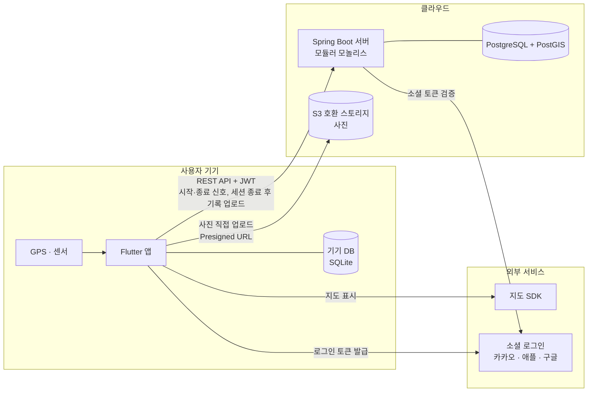
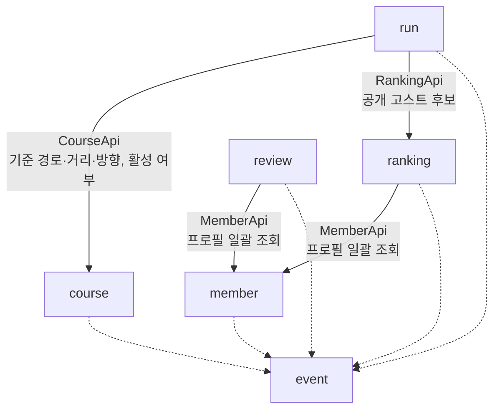
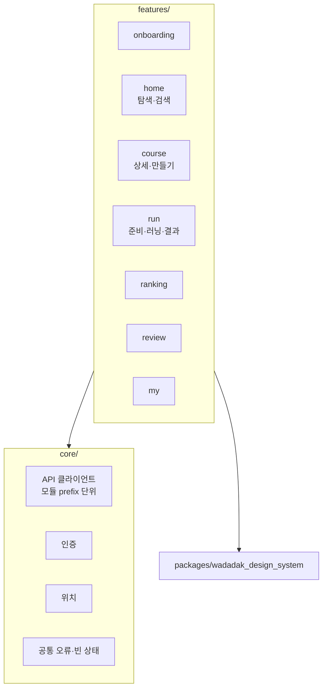
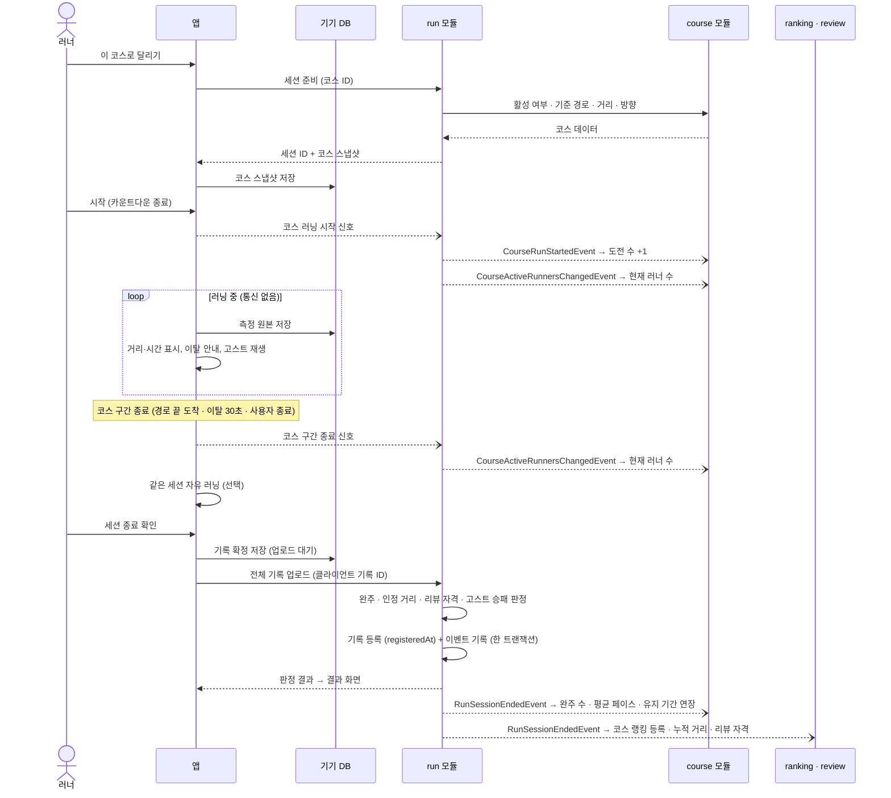
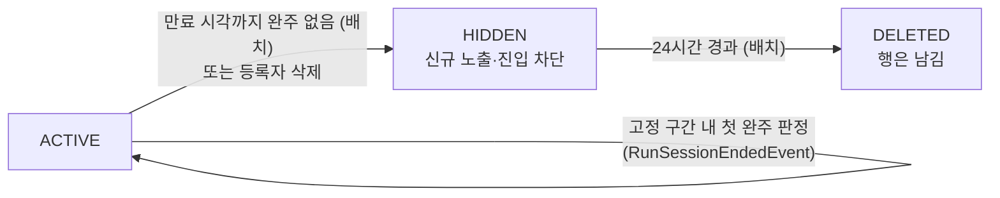
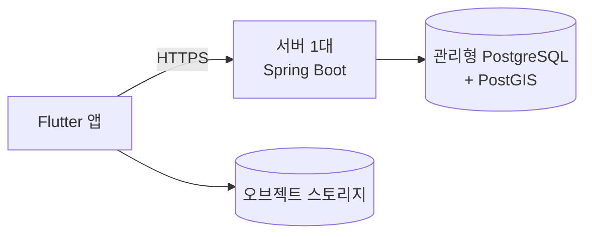

# 아키텍처

상태: 초안 · 작성일 2026-10-06

> **문서 목적**: 와다닥 서비스의 전체 구조(앱·서버·DB·외부 서비스), 서버 모듈 구조, 핵심 데이터 흐름, 배포·확장 방향을 정한다.
> 기준 문서: 기능 규칙은 [`정책 문서.md`](정책%20문서.md)(최종 정책), 개발 규칙은 [`개발 정책 v3.md`](개발%20정책%20v3.md), 달리기 세부 설계는 [`run/달리기 개발 아키텍처`](run/달리기%20개발%20아키텍처%20-%202026-10-06.md)를 따른다. 이 문서는 전체 그림만 다룬다.

## 1. 설계 목표

| 순위 | 목표 | 근거 |
| --- | --- | --- |
| 1 | **러닝 기록은 잃지 않고, 완주는 서버만 판정한다** | 통신 끊김·앱 종료·다른 기능 오류와 무관하게 기록 보존. 완주 판정 권한은 서버에만 있음 (정책 공통 1, 달리기 8장) |
| 2 | **오프라인에서도 측정이 된다** | 코스·고스트 데이터는 시작 전에 받아두고, 측정·저장은 기기에서 계속 (ERR-04, ERR-05) |
| 3 | **소규모 팀이 빠르게 만든다** | MVP 단계 → 운영 부담이 적은 구조 |
| 4 | **나중에 나눌 수 있다** | 부하가 큰 기능(run)을 별도 서버로 분리할 수 있게 경계를 지킨다 (개발 정책 v3 11장) |

## 2. 시스템 구성

| 구성 요소 | 역할 |
| --- | --- |
| Flutter 앱 | 화면, 지도, GPS 측정, 기기 저장·재전송, 거리·시간 표시, 이탈 안내, 고스트 재생, 음성 안내, **코스 구간 종료 결정**. 완주·잠정 완주를 판정하지 않는다 |
| 기기 DB | 러닝 중 측정 원본, 업로드 대기 기록, 시작 전 받아둔 코스·고스트 데이터 |
| Spring Boot 서버 | 모든 비즈니스 로직. **완주·코스 인정 거리·리뷰 자격·고스트 승패를 단독 판정**, 랭킹·통계 집계, 만료 배치 |
| PostgreSQL + PostGIS | 모든 영구 데이터, 지도 영역 조회·겹침 판정·선투영 계산 |
| S3 호환 스토리지 | 프로필·리뷰 사진. 앱이 직접 업로드 |
| 소셜 로그인 | 앱이 소셜 토큰을 받고, 서버(member)가 검증한 뒤 자체 JWT 발급 |

화면 갱신(현재 러너 수 등)은 앱이 주기적으로 조회한다. 실시간 푸시 연결(SSE·WebSocket)은 두지 않는다.

## 3. 서버 내부 구조

### 3.1 모듈 구성

서버는 하나로 배포하고 내부를 도메인 모듈로 나눈다(Spring Modulith). 상세는 개발 정책 v3 2장.

| 모듈 | 책임 |
| --- | --- |
| member | 인증·JWT 발급, 프로필, 공개·검색 허용 설정 |
| course | 코스 등록·탐색·검색, 저장 코스, 유지 기간·만료, 코스 통계(누적·일별), 현재 러너 수 복사본 |
| run | 러닝 세션·측정 저장, 완주·리뷰 가능 판정, 고스트 대결 결과, 현재 러너 수 |
| ranking | 코스 랭킹, 누적 거리 랭킹, 공개 고스트 선택 |
| review | 리뷰 작성·수정·삭제, 리뷰 자격 보관 |
| event | 모듈 간 이벤트 record(메시지 계약)만 보관. OPEN 모듈 |
| common | 설정, 공통 응답·예외, 페이징, 아웃박스 재시도, 지역 참조 데이터. OPEN 모듈 |

### 3.2 모듈 의존 방향

- 실선: 동기 호출(공개 인터페이스, 조회 전용). 화살표 방향으로만 호출한다.
- 점선: 이벤트 양식 의존. 모든 모듈은 `event` 모듈의 양식으로 이벤트를 보내고 받는다.
- 모든 모듈은 `common`에 의존한다(그림에서 생략).
- **순환이 없다.** 역방향 소통은 전부 이벤트로 한다. ranking·review의 코스 노출 여부는 동기 호출 대신 코스 상태 복사본을 쓴다.

### 3.3 모듈 간 소통 방식

| 방식 | 언제 | 예 |
| --- | --- | --- |
| 동기 호출 | 지금 이 순간의 정확한 상태가 필요할 때 | 러닝 시작 시 코스 경로·활성 여부 |
| 이벤트 | "이런 일이 일어났다"를 알려 다른 모듈이 각자 따라가게 할 때 | 세션 종료·판정 → 유지 기간 연장·랭킹·리뷰 자격·통계 |
| 복사본 | 다른 모듈 값으로 정렬·필터하거나, 원본이 사라져도 보여야 할 때 | 코스의 도전 수·평점·현재 러너 수, 기록의 당시 코스명 |

이벤트는 Spring Modulith 아웃박스로 보낸다. 데이터 저장과 이벤트 기록이 한 트랜잭션이라 유실되지 않고, 실패한 수신만 재시도한다. 이벤트 목록은 개발 정책 v3 5.6.

## 4. 앱 구조

- 구조와 진행 상황은 FrontEnd README를 기준으로 한다(개발 정책 v3 9장).
- 앱은 서버 주소 하나(base URL)만 안다. 분리 후에도 게이트웨이가 같은 경로를 받는다.
- **run은 측정을 화면 생명주기와 분리한다.** 화면을 이동하거나 지도를 숨겨도 수집·기기 저장이 계속된다. 내부 구성(Recorder·SyncWorker 등)은 run 달리기 개발 아키텍처 3장.

## 5. 핵심 흐름

### 5.1 코스 러닝 (시작부터 랭킹 반영까지)

- 러닝 중에는 통신하지 않는다. 시작·구간 종료 신호는 짧은 요청이며, 오프라인이면 생략하고 기록 업로드 때 함께 처리한다.
- 완주 시각은 서버가 측정 데이터에서 완주 조건을 **처음 충족한 시점**이다. 앱이 그보다 늦게 구간을 끝냈어도 이후 표본은 세션 기록에만 들어가고, 앱이 그 전에 끝냈으면 미완주다.
- 유지 기간 연장·랭킹 등록·통계는 모두 세션 종료 후 판정 결과(`RunSessionEndedEvent`)로 처리한다. 랭킹 기간 귀속은 기록 등록 시각(registeredAt)이다.
- 업로드는 클라이언트 기록 ID로 중복을 막는다. 재업로드는 같은 결과를 돌려주고 기록 등록 시각을 바꾸지 않는다.

### 5.2 판정 위치

| 처리 | 앱 | 서버 (run) |
| --- | --- | --- |
| 거리·시간·페이스 표시, 자동 랩 | 계산·표시 | 저장 결과로 재계산 |
| 이탈 후보·확정 안내 | **실시간** (표시용 선투영) | - |
| 코스 구간 종료 (경로 끝 도착·이탈 30초·사용자 종료) | **앱이 결정** | 종료 시점 이전 데이터로만 완주 판정 |
| 고스트 재생·격차 | **실시간** (총 소요시간 축) | - |
| 완주 (출발·도착 GPS + 경로 끝 도달 + 코스 인정 거리 ≥ 전체 거리 × 95%) | 판정하지 않음 | **단독 판정** |
| 코스 인정 거리·진행도, 리뷰 자격 | 판정하지 않음 | **단독 판정** (리뷰 자격은 종료·저장 후) |
| 고스트 승패·무효 | 판정하지 않음 | **단독 판정** |

- 판정용 웨이포인트는 없다. 지도의 1km 거리 표지는 표시용이며 판정에 쓰지 않는다.
- 랭킹·리뷰 자격·유지 기간 연장은 서버 판정 결과만 사용한다.
- "코스 구간 종료를 앱이 정한다"는 정책 RUN-08(서버 완주 확정 시 전환)과 다르다. 정책 협의 중이다(8장).

### 5.3 오프라인·통신 단절

러닝 중에는 원래 통신하지 않으므로 통신 단절이 러닝에 영향을 주지 않는다.

- 시작할 때 통신이 없으면 받아둔 코스로 측정하고, 시작 신호는 기록 업로드 때 함께 보낸다(코스·고스트 오프라인 신규 시작 허용 여부는 8장).
- 세션 종료 후 업로드가 실패하면 "기기에 저장됨 · 동기화 대기"로 표시하고 연결되면 재시도한다.
- 정책의 "통신 90초 단절 시 코스 마감"(ERR-04)은 이 구조에 맞지 않아 삭제를 협의한다(8장).

### 5.4 코스 만료

- 유지 기간은 등록일 포함 30일, 등록일부터 **30일씩 고정 구간**으로 나눈다. 구간 안에서 서버가 확정한 첫 완주로 현재 만료일에서 30일 연장하고, 같은 구간의 추가 완주로는 다시 연장하지 않는다(완주자 무관).
- 상태가 바뀔 때마다 `CourseStatusChangedEvent`를 발행한다. ranking·review는 `HIDDEN`이면 노출을 막고, `DELETED`면 그 코스의 랭킹·리뷰 데이터를 지운다. course도 그 코스의 통계를 지운다(정책 공통 4).
- 정책은 "만료 후 도착한 완주 이벤트는 연장하지 않는다"이다. 판정이 세션 종료 업로드 후라서 늦게 업로드하면 연장되지 않는다(정책대로). 이벤트 재시도로 수신만 늦어지는 경우는 `registeredAt` 기준 여부를 정책 D-10 확정에 따른다.
- 이미 시작한 러닝은 시작 시 받은 스냅샷으로 계속 진행하고, 결과는 개인 기록으로만 보존한다.

## 6. 배포 구성

### 6.1 MVP

| 항목 | 구성 |
| --- | --- |
| 서버 | 1대 (Docker 이미지로 배포) |
| DB | 관리형 PostgreSQL 1대 + PostGIS, 모듈별 스키마 |
| 파일 | S3 호환 오브젝트 스토리지 |
| 로컬 개발 | Docker Compose로 PostGIS 실행 |
| CI | GitHub Actions: 빌드, 테스트(Testcontainers), `verify()`, 모듈 단독 기동 테스트 |

### 6.2 확장 경로

| 단계 | 시점 | 변경 |
| --- | --- | --- |
| 1 | MVP | 서버 1대, DB 1대 |
| 2 | 동시 접속이 늘 때 | 서버 여러 대 + 로드밸런서. 배치·재시도 스케줄은 ShedLock으로 한 대에서만 실행 |
| 3 | run 부하가 다른 기능에 영향을 줄 때 | run을 별도 서비스로 분리. 이벤트를 메시지 브로커로 외부화, 동기 호출을 HTTP 구현체로 교체, run 스키마를 전용 계정·DB로 이동 |
| 4 | 실제 지표를 보고 | ranking 등 추가 분리 검토 |

분리 기준·준비도 체크·단계별 절차는 개발 정책 v3 11장.

## 7. 주요 결정 기록

| 결정 | 이유 | 검토한 대안 |
| --- | --- | --- |
| 모듈러 모놀리스로 시작 | 소규모 팀·MVP. 운영 부담 최소 | 처음부터 MSA: 인프라·분산 디버깅 비용이 큼 |
| run을 첫 분리 후보로 | GPS 업로드·판정 부하가 크고 장애 격리 이점이 분명 | 처음부터 전부 분리 |
| DB 1대 + 모듈별 스키마, 모듈 간 FK 0개 | 비용·운영 단순, 분리 시 스키마째 이동 | 모듈별 DB: MVP에서는 과함 |
| 모듈 간 변경은 이벤트(아웃박스) | 다른 기능 오류가 러닝 기록 저장을 막지 않음, 유실 없음 | 직접 호출: 한 곳 실패 시 기록 저장까지 실패 |
| 이벤트 양식은 `event` 모듈에 | 모듈 간 순환 의존 방지 | 발행 모듈에 보관: 동기 호출과 겹쳐 순환 발생 |
| **완주는 서버 단독 판정** | 정책 공통 1. 랭킹·연장·리뷰 자격의 신뢰성 | 앱 판정 또는 앱 잠정 판정: 정책상 불가 |
| **러닝 중 통신 없음, 세션 종료 후 업로드** | 배터리·신호 약한 구간에 강함, API 단순. 코스 구간 종료는 앱이 정하고 완주는 서버가 판정 | 러닝 중 묶음 업로드: 통신 부담, 신호 끊김에 취약 |
| **현재 러너 수 = 시작·구간 종료 신호** | 러닝 중 통신 없이 집계. 신호 누락은 시간 경과로 자동 제외 | 주기적 생존 신호: 통신 부담 |
| **판정용 웨이포인트 미사용** | 정책 공통 3. 선투영 + 출발·도착 GPS + 인정 거리 95%로 판정 | 웨이포인트 순서 통과: 폐기된 정책 |
| 코스·회원 논리 삭제 | 개인 기록 보존, 오프라인 업로드, 이벤트 기반 정리 | 실제 삭제 + CASCADE: 남의 기록까지 삭제됨 |
| 실시간 푸시 연결 없음, 화면은 폴링 | 현재 러너 수 1분 갱신·랭킹 수동 갱신이면 충분. 다중 인스턴스 부담 없음 | SSE: 필요한 기능 없음 |
| 앱은 오프라인 우선 | 러닝 중 통신 끊김이 흔함 | 실시간 서버 전송 의존 |

## 8. 확인 필요

| 항목 | 내용 | 담당 |
| --- | --- | --- |
| 코스·고스트 오프라인 신규 시작 | 시작 시 통신이 없을 때 받아둔 코스로 시작을 허용할지, 도전 수를 언제 올릴지 | 정책·달리기 |
| 현재 러너 수 자동 제외 시간 | 종료 신호 없는 세션을 시작 후 몇 시간 뒤 뺄지 (예: 3시간, 정책 D-14) | 달리기 |
| 정책 협의 | 코스 구간 종료 주체(RUN-08), 완주 음성 시점(AUD-06), 통신 90초 규칙 삭제(ERR-04), 현재 러너 수 정의(공통 7) | 정책 |
| 완주 이벤트 지연과 만료 경계 | `registeredAt` 기준 사용 여부 (정책 D-10) | 정책·홈코스 |
| B3 최종 경로 생성 | 입력점을 직선으로 이을지 도로를 따라 이을지. 도로를 따르면 경로 탐색 엔진·외부 API 추가 | 정책·홈코스 |
| 법정동 판별 | 행정구역 경계 데이터를 PostGIS에 넣을지(추천), 외부 API를 쓸지 | 홈코스 |
| GPS 코스 등록 경로 전달 | run의 실제 주행 경로를 course로 넘기는 방식. course → run 호출은 순환이라 금지 | 홈코스·달리기 |
| 백그라운드 GPS | 실기기(iOS 1대, 삼성 Android 1대)에서 화면 끄고 30분 측정 유지 검증 | 달리기 |
